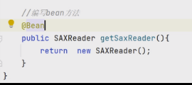

# 补充知识

## Bean管理

### 获取bean

> - 默认情况，Spring项目启动时，会把bean创好放在IOC中
>   - 扫描启动类的包内全部内容
> - 主动获取
>   - 名字
>     - 默认是类名称小写
>   - 类型

### bean作用域

### 第三方bean

> - @Bean
>
>   - 编写Bean方法
>
>   - 标注@Bean注解，可指定名称，默认是方法名
>
> 
>
> - 不建议写在启动类，最好单独写一个配置类
>
>   - @configuration
>
>     - 不仅包含@Component，还能表示是个配置类
>
>    - 如果第三方Bean还需要依赖其它bean对象，直接在bean中设置形参就好 (容器里要有)

