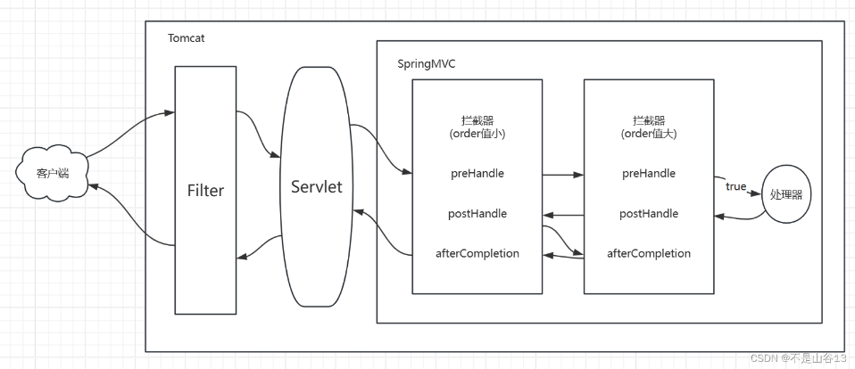
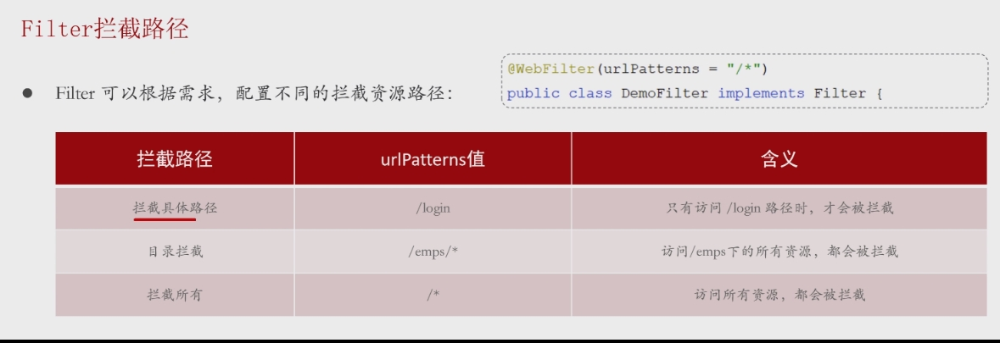
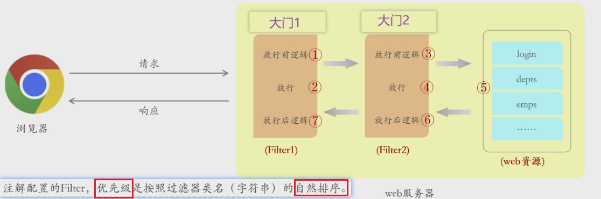

## 概述




> - Java Web 三大组件之一（Servlet、Filter、Listener）
>
> - **Tomcat提供**
>- 框架还未执行到，故无法自动封装，需手动处理request和response
>     - 登录校验
>     - 统一的编码处理
>   
>- Java Servlet 技术中的一个重要部分，主要用于在   **Servlet 处理请求之前或响应之后**    一般完成一些通用操作
> 
>
>   
>- 它随 web 应用启动而启动，只初始化一次，以后就可以拦截相关请求。只有当你的 web 应用停止或重新部署的时候才销毁


## 过滤器实现

### 实现 FIlter 接口 + @WebFilter(urlPatterns = " ")

```java
@WebFilter(urlPatterns = "/*")
public class FilterDemo1 implements Filter {

    //重写doFilter方法
    //拦截请求后自动调用此方法
    //可多次调用
    //放行操作很重要，要不然一直拦在那
    //令牌放在请求包
    
    @Override
    public void doFilter(ServletRequest servletRequest, ServletResponse servletResponse, FilterChain filterChain) throws IOException, ServletException {
        System.out.println("拦截到了请求");

        //放行
        filterChain.doFilter(servletRequest,servletResponse);
 
    }
```


### 在引导类加上Servelt组件扫描器

> - @ServletComponentScan
>
> - 过滤器是Servelt组件，需要在引导类加上扫描器,否则识别不到


## 拦截路径




## 执行流程

> 过滤前 -> 放行 -> 资源 -> 放行后


## 过滤器链

