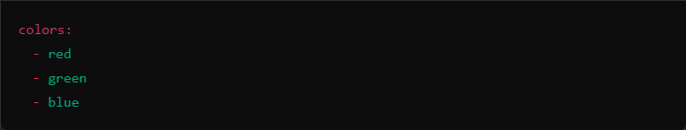
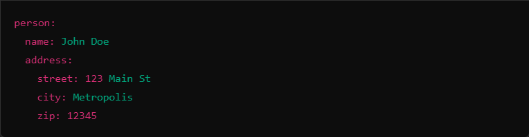
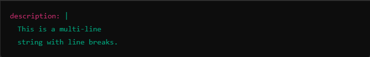
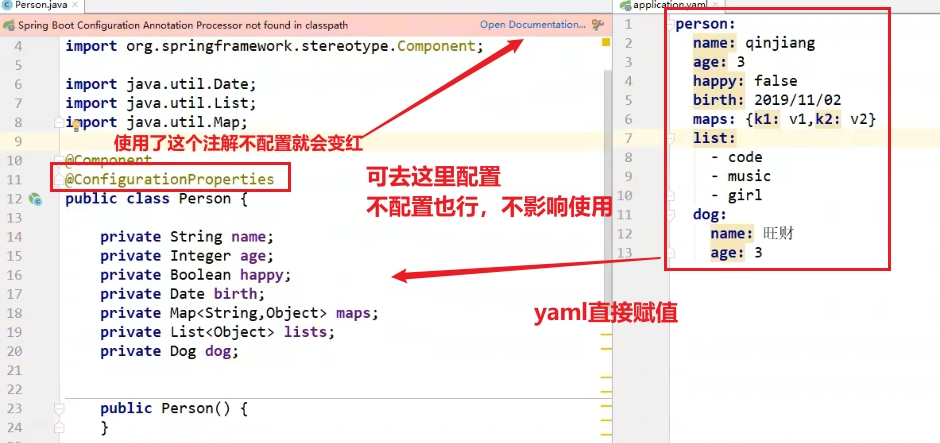
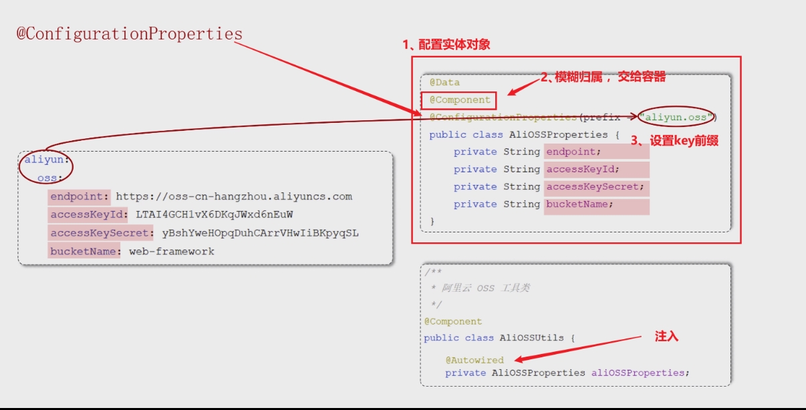
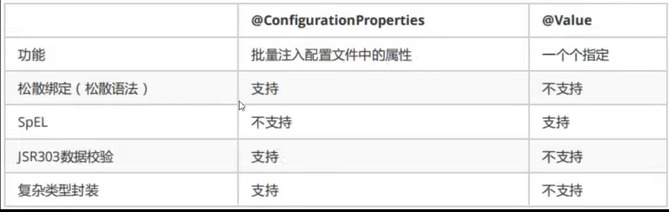

## 概述

> - 使用缩进来表示层级结构，轻便简洁
> - 能够表示多种数据结构，如对象、列表、键值对、嵌套结构等，适合表达复杂的配置和数据
> - 以数据为中心

## 语法规则

> - 键值对
>   - key:空格value
> - 缩进
>   - 对空格要求极为严格
>   - 数值前必须有空格，作为分隔符
>   - 使用缩进来表示层级关系，不允许使用Tab，只能用空格
> - 大小写敏感
> - #表示注释

## 常用结构

> - 数组
>   - 使用 - 表示列表中的元素
>
> 
>
> - 对象
>
>   - 使用空格缩进来表示层级关系
>
>   
>
> - 多行字符串
>
>   - 使用 `|` 或 `>` 
>
>     																							 

## 使用

### 单个

- @value

### 批量  

- 实体类对象 + @ConfigurationProperties

  

### 比较

