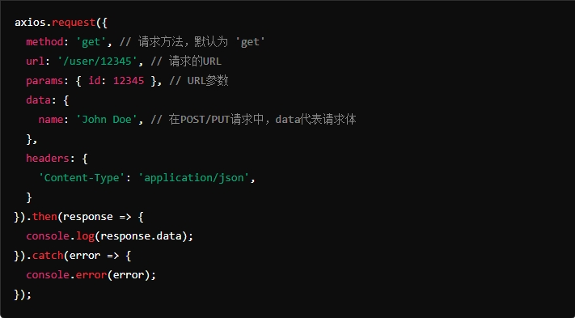
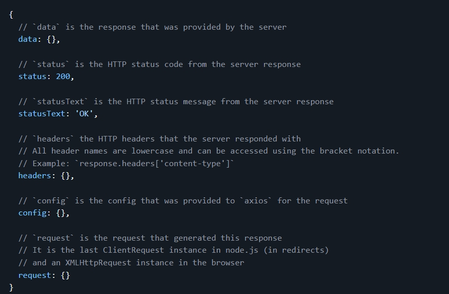

## 概述

> - 是一个基于 Promise 的 HTTP 客户端，广泛用于浏览器和 Node.js 中。
>   - 从浏览器发出XMLHttpRequests
> - 对ajax进行封装，简化Ajax书写。
> - 它提供了一种简单易用的 API 来发送 HTTP 请求和处理响应，和后端服务器进行交互
> - **异步请求**
> - JSON数据的自动转换
> - 拦截请求和响应


## 作用

> - 向服务器发送 HTTP 请求，并处理服务器返回的数据
> - 它提供了一个简单的 API 来进行  **异步请求** ，并处理响应。


## 与ajax

> - AJAX 是一种技术，描述了如何在网页中进行异步数据传输。
> - Axios 是一个 HTTP 客户端库，实现了 AJAX 功能，提供了更简洁和功能丰富的 API。


## 安装

> - npm install axios


## Vue中导入axios

```vue
import axios from "axios";
```


## 常用请求方法及参数

> - Axios的请求方法接受的参数通常是一个对象，包含了请求的配置选项，如 URL、请求方法、请求头、请求体


### 常用参数

> - url: 请求的 URL 地址（对于 get 方法可以直接作为第一个参数传递）
> - method: 请求方法，如 GET、POST、PUT、DELETE 等。默认为 GET
> - headers: 请求头，指定请求的 HTTP 头部信息。
> - params: 请求的查询参数（通常用于 GET 请求）。Axios 会将对象自动转换为查询字符串。
> - data: 请求体（通常用于 POST、PUT、PATCH 请求）。用于发送数据到服务器。
> - timeout: 请求超时时间（单位：毫秒）。如果请求在指定时间内没有完成，则会抛出超时错误。
> - auth: HTTP 基本认证信息。可以指定 username 和 password。
> - responseType: 响应数据类型，如 json、text、blob、arraybuffer 等。
> - maxRedirects: 最大重定向次数。
> - proxy: 代理设置，可以用于配置请求代理。


### axios.request（配置）

> - 是 Axios 底层的通用方法，允许你通过配置对象来发送 HTTP 请求。
> - 与直接使用 axios.get、axios.post 等方法相比，更加灵活和通用。




### 其他方法概览

> - axios.get（url [，配置]）
> - axios.delete（url [，配置]）
> - axios.head（url [，配置]）
> - axios.options（url [，配置]）
> - axios.post（url [，数据 [，配置]]）
> - axios.put（url [，数据 [，配置]]）
> - axios.patch（url [，数据 [，配置]]）


### get请求

> - 两个参数：URL + 配置对象

```vue
axios({
      method: "get",
      url: "http://localhost:8088/hh?id=ii&id=jj",
    })
    .then(response => {
        console.log(response.data); // 处理响应数据
    })
    .catch(error => {
        console.error('Error:', error); // 处理错误
    });
```


### post请求

> - 三个参数：URL + 请求体 + 配置对象

```vue
axios({
        method: "Post",
        url: "http://localhost:7777/posts",
        //设置请求体
        data: {
          id: "3",
          title: "今天天气不错",
          author: "hh",
        },
      })
```


### put请求

```vue
axios({
        method: "Put",
        url: "http://localhost:7777/posts/3",
        //设置请求体
        data: {
          title: "今天天气不错",
          author: "二木",
        }
      })
```


### delete请求

```
axios({
        method: "Delete",
        url: "http://localhost:7777/posts/3",
      })
```


## 响应包

### 概述

> - 返回结果是一个Promise对象
> - 自动封装成对象


### 成分

> - data：服务器返回的数据进行Json解析成一个JS对象
> - headers：服务器返回的响应头
> - config：Axios 请求时的配置对象
> - request：发送的请求对象
> - status：HTTP 状态码（如 200、404 等）
> - statusText：HTTP 状态文本（如 "OK"）




### 处理  --  **.then**

```
axios.get('/user/12345')
  .then(function (response) {
    console.log(response.data);
    console.log(response.status);
    console.log(response.statusText);
    console.log(response.headers);
    console.log(response.config);
  });
```


