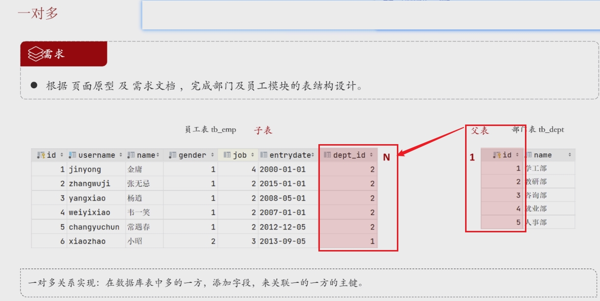

## 概述

> - 主要用于从数据库中查询数据。
> - **DQL** 虽然经常被单独提出来，但它实质上是 DML 的一个子集，专注于 **数据查询**。

## Select语句基本结构

```
SELECT column1, column2, ...
FROM table_name
[WHERE condition]
[GROUP BY column]
[HAVING condition]
[ORDER BY column [ASC|DESC]]
[LIMIT number];
```

## 单表查询

### 基础查询

```mysql
SELECT * 
FROM employees;
```

```
SELECT name, salary 
FROM employees;
```

### 条件查询 - - where

```
SELECT name, salary 
FROM employees
WHERE salary > 50000;
```

```
SELECT name, position, salary 
FROM employees
WHERE position = 'Manager' AND salary > 70000;
```

### 排序查询 - - ORDER BY

```
SELECT name, salary 
FROM employees
ORDER BY salary DESC;
```

> - 可以按升序（`ASC`）或降序（`DESC`）排序。

### 分组查询

> - 分组查询常用于  **汇总数据、计算统计信息或对数据进行分类分析**
> - 它与聚合函数（如 `COUNT`、`SUM`、`AVG`、`MAX`、`MIN` 等）结合使用，可以有效地对数据进行分析和报告。
> - 按照GROUP BY 后的字段分组，字段属性名作为 分组的组名
> - **分组后返回的字段    一般为 聚合类函数 或 分组字段**

```
SELECT department, AVG(salary) AS avg_salary
FROM employees
GROUP BY department;
```

###  having 过滤分组后的数据

> - `HAVING` 子句用于对 `GROUP BY` 分组后的结果进行过滤。
> - 与 `WHERE` 类似，但 `HAVING` 是在分组之后进行过滤的，而 `WHERE` 是在分组之前进行过滤的。

```
SELECT department, AVG(salary) AS avg_salary
FROM employees
GROUP BY department
HAVING AVG(salary) > 60000;
```


### 聚合函数

#### 概述

> - 将一列数据作为一个整体，进行纵向计算，而不是逐行比较。
> - 它们的目的是将多行数据聚合成一个单一的值

####　常见函数

> - count：统计数量
>   - count(*)*
>   - 是标准的统计行数的语法
>   - 聚集函数除count()之外，都跳过空值只处理非空值
> - max
> - min
> - avg
> - sum


### 多列分组

> - 可以根据多个列进行分组，这样可以创建更  **细粒度**  的分组。

```
SELECT department, position, COUNT(*) AS employee_count
FROM employees
GROUP BY department, position;
```

> - 此查询将 `employees` 表中的数据按 `department` 和 `position` 列分组，并计算每个职位在各个部门的员工数量。

#### 示例1

> - 表如下

| id   | username    | password | real_name | gender | image | dept_id | position | hire_date  |
| ---- | ----------- | -------- | --------- | ------ | ----- | ------- | -------- | ---------- |
| 4    | weiyixiao   | 123456   | 韦一笑    | 1      | 4.jpg | 2       | 2        | 2007-01-01 |
| 5    | changyuchun | 123456   | 常遇春    | 1      | 5.jpg | 2       | 2        | 2012-12-05 |
| 6    | xiaozhao    | 123456   | 小昭      | 2      | 6.jpg | 1       | 3        | 2013-09-05 |
| 7    | jixiaofu    | 123456   | 纪晓芙    | 2      | 7.jpg | 1       | 1        | 2005-08-01 |

> - 查询语句如下

```
SELECT gender, dept_id, COUNT(*) AS count
FROM employees
GROUP BY gender, dept_id;
```

> - 结果如下

| gender | dept_id | count |
| ------ | ------- | ----- |
| 1      | 1       | 0     |
| 1      | 2       | 2     |
| 2      | 1       | 2     |
| 2      | 2       | 0     |


#### 示例2

> - 表如下

| name  | department | position  | salary |
| ----- | ---------- | --------- | ------ |
| Alice | HR         | Manager   | 60000  |
| Bob   | HR         | Assistant | 40000  |
| Carol | Sales      | Manager   | 70000  |
| David | Sales      | Assistant | 50000  |
| Eve   | IT         | Manager   | 80000  |
| Frank | IT         | Assistant | 45000  |

> - 查询语句如下

```
sql复制代码SELECT department, position, COUNT(*) AS employee_count
FROM employees
GROUP BY department, position;
```

> - 结果如下

| department | position  | employee_count |
| ---------- | --------- | -------------- |
| HR         | Assistant | 1              |
| HR         | Manager   | 1              |
| IT         | Assistant | 1              |
| IT         | Manager   | 1              |
| Sales      | Assistant | 1              |
| Sales      | Manager   | 1              |


### 与order by 结合使用

> - 可以在分组查询中使用 `ORDER BY` 对分组结果进行排序。

```
ELECT department, 
       SUM(salary) AS total_salary
FROM employees
GROUP BY department
ORDER BY total_salary DESC;
```

> - 此查询将 `employees` 表中的数据按 `department` 列分组，并按每个部门的总工资降序排列。


## 多表查询

### 消除笛卡尔积

> 笛卡尔积现象，A和B所有的组合情况

#### 连接查询

> - 左外连接

```
select * from tb_emp a left join tb_dept td on a.dept_id = td.id;
```

> - 连接查询 —— 缺啥连啥，连上了在筛选 —— 最暴力

```
select e.* from tb_emp e ,tb_dept b where e.dept_id=b.id and b.id=2;
```

#### 子查询

> - 子查询（嵌套查询）—— 先一步到位，将无法查询的定义为子sql

```
-- 一步到位
select * from tb_emp where dept_id = 2;

-- 查询教研部id
select id from tb_dept where name ='教研部';

-- 整合
select * from tb_emp where dept_id =(select id from tb_dept where name ='教研部');
```


## 多表关系

> - 创建唯一关系 --- 外键

### 一对多




### 一对一

> - 表的拆分
>   - 水平拆分
>   - 垂直拆分
> - 在任意移方加入外键，关联另一方的主键，不允许重复


### 多对多

> - 建立中间表
>   - 两个外键，关联两个表


## 特殊匹配

### 双值if匹配

```
select if(gender=1,'男','女' )性别  ,count(*) 数量
from tb_emp
group by gender;
```

### 多值case匹配

```
select case job
    when 1 then'讲师'
    when 2 then'班主任'
    when 3 then'教研主管'
    else '保洁'
    end job
       ,count(*) 数量
from tb_emp
where job is not null
group by job;
```


