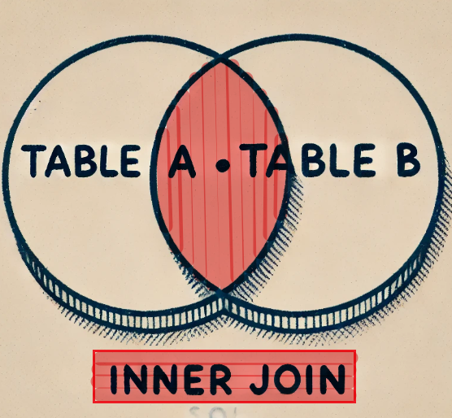
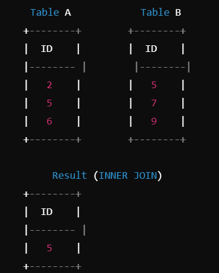
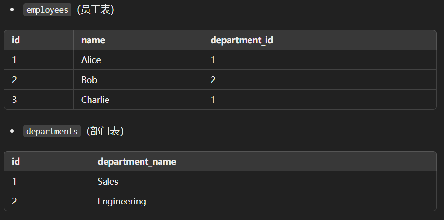
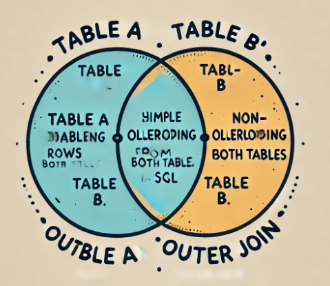
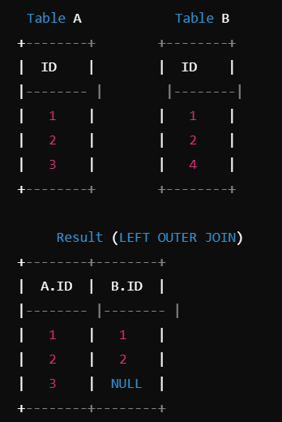
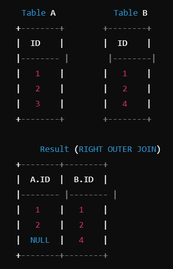

**==本质：全查出来在排除笛卡尔积==**

## 概念

> - ==**联接的本质是关系数据库中的一种操作，目的是根据一个或多个公共字段，将不同表的数据“关联”在一起，生成一个结果集。**==
> - 它允许用户从多个表中检索相关的数据，而不需要将所有数据存储在一个巨大的表中。
> - 通过联接，可以在保持数据规范化（即减少数据冗余）的同时，进行复杂的查询。


## 规范化  --  分离

> - 关系数据库的设计基于**关系**模型，数据被存储在多个相互关联的表中。
> - 这种设计使得数据能够分开存储，从而减少重复、节省存储空间，并提升数据维护的效率。
> - 这种分离存储的设计原则被称为**数据库规范化**。
> - 然而，在实际操作中，查询时常常需要将这些分离的数据  **==再次组合==**，这就是联接的主要任务。


## 渊源

> - 联接的概念源自数学的集合论和关系代数，特别是关系模型的发明。
> - 它最初是数学上的一种集合操作，通过将两组数据基于特定条件组合在一起，形成一个  **==新的集合==**。
> - 关系数据库中的联接概念便是从这种数学操作演变而来。
> - 在数学中，联接类似于两个集合的  “**==笛卡尔积==**”（Cartesian product），也就是将一个集合的所有元素与另一个集合的所有元素进行组合。
> - 在数据库中，联接通常是有  **==条件==**  的，即通过某个共同属性来匹配两个表中的数据。这样避免了产生庞大的笛卡尔积，从而  **==只返回有意义的结果==**。


## 作用

> - **数据关联：**
>   -  数据库中的不同表通常用于存储不同类别的信息。
>   - 联接操作允许用户根据某些条件将这些信息关联起来，从而获取完整的业务信息。
>   - 例如，员工信息和部门信息分别存储在不同的表中，联接可以把某个员工和他所属的部门对应起来。
> - **数据抽取：** 
>   - 联接允许用户从多个表中提取数据，而无需在每个表中重复存储相同的数据。
>   - 这提高了数据的可维护性和可扩展性。
> - **查询优化：** 
>   - 使用联接能够提高复杂查询的灵活性。
>   - 联接使得用户可以基于多个表的关系进行查询，而不是将所有数据存储在一个表中，避免了数据的重复存储和冗余问题。
> - **简化逻辑：** 
>   - 使用联接可以简化查询的逻辑。
>   - 比如，如果所有数据存储在一个单一的表中，数据的重复和查询的复杂性将大大增加。
>   - 联接通过表的分割和关系的建立，使得查询逻辑更加直观。


## 概念区分

> - 与联接常常被混淆的一些概念有“联合（UNION）”和“嵌套查询（Subquery）”：
>   - **联接（Join）：** 将多个表中的数据组合在一起，  **==返回的结果集包含来自多个表的列==**
>   - **联合（UNION）：** 将两个  **==结果集按行进行合并==**，即将两个查询的结果连接成一个大集合。`UNION` 操作需要两个结果集具有相同的列数和类型。
>   - **嵌套查询（Subquery）：** 在查询中使用另一个查询的结果作为条件或数据源，嵌套查询有时也可以替代某些联接操作，但通常它的语法和执行逻辑更为复杂。


## 意义

> - **数据一致性和完整性：** 由于关系型数据库的规范化原则，数据往往被分散存储。联接可以将这些分散的数据  **==按照需求整合==**起来，并确保数据的准确性和一致性。
> - **提高查询效率：** 联接在现代数据库管理系统中经过  **==高度优化==**，**通过索引和缓存技术，能够显著提高多表查询的效率**。

> - 联接的前提是**==有关联的分割==**
>   - 这种关联通常是通过一个或多个共同的字段（也称为键）来建立的
>   - 例如，两个表之间可以通过主键和外键的关系来关联
>   - 根据共同字段，将不同表中的数据结合在一起。


## 常见连接种类

> - **内联接（INNER JOIN）**
> - **外连接**
>   - **左外联接（LEFT JOIN）**
>   - **右外联接（RIGHT JOIN）**
> - **自连接（Self Join）**
> - 全联接（FULL JOIN）
> - 交叉联接（CROSS JOIN**


## 内连接





> - “内”指的是连接操作的性质，即仅返回两个表中存在匹配记录的部分。
> - 具体来说，“内”表示“内部的”或“内部匹配的”，强调了连接的结果是基于两个表之间的  **==交集==**。

#### 表



#### SQL查询

##### 步骤

> - 使用 `INNER JOIN` 语句将两个表通过 `department_id` 和 `id` 进行  **==联接==**。
>
> - **==选择要显示的字段==**，这里是员工姓名和部门名称。
> - 返回的是两个表中匹配的记录，只有在 `employees` 表的 `department_id` 和 `departments` 表的 `id` 相等时才会返回。

```mysql
SELECT employees.name, departments.department_name
FROM employees
INNER JOIN departments ON employees.department_id = departments.id;
```

#### 结果


## 外联接

> - "外"（OUTER）是用来描述连接的类型
> - 表示在连接操作中包括了某些记录，即使它们在另一张表中没有匹配项。



### 表数据

#### 表1: `employees`

| id   | name    | department_id |
| ---- | ------- | ------------- |
| 1    | Alice   | 101           |
| 2    | Bob     | NULL          |
| 3    | Charlie | 102           |
| 4    | Dave    | 103           |

#### 表2: `departments`

| id   | department_name |
| ---- | --------------- |
| 101  | HR              |
| 102  | Engineering     |
| 104  | Sales           |

------


### 左外连接



> - 返回==**左表的所有**==记录以及与右表匹配的记录。
> - 如果右表没有匹配，右表的字段会显示为 `NULL`。


#### 查询：

```mysql
SELECT employees.name, departments.department_name
FROM employees
LEFT JOIN departments ON employees.department_id = departments.id;
```

#### 结果：

| name    | department_name |
| ------- | --------------- |
| Alice   | HR              |
| Bob     | NULL            |
| Charlie | Engineering     |
| Dave    | NULL            |

#### **解释**

> - 在左连接中，`employees` 表中的所有记录都被返回。
> - 如果某个 `employees.department_id` 在 `departments` 表中没有匹配项，则 `department_name` 返回 `NULL`（如 Bob 和 Dave 的情况）。


### 右外连接



> - 返回==**右表的所有**==记录以及与左表匹配的记录。
> - 如果左表没有匹配，左表的字段会显示为 `NULL`

#### 查询

```
sql复制代码SELECT employees.name, departments.department_name
FROM employees
RIGHT JOIN departments ON employees.department_id = departments.id;
```

#### 结果：

| name    | department_name |
| ------- | --------------- |
| Alice   | HR              |
| Charlie | Engineering     |
| NULL    | Sales           |

#### **解释**

> - 在右连接中，`departments` 表中的所有记录都被返回。
> - 如果某个 `departments.id` 在 `employees.department_id` 中没有匹配项，则 `name` 返回 `NULL`（如 Sales 的情况）。


## 自连接

### 概述

> - **自连接**是一种特殊的连接类型，指的是将一张表与自身进行连接。
>   - **==要起别名==**
> - 这种操作用于在同一张表中的记录之间建立关系
>   - 例如父子关系、管理层关系等。
> - 自连接可以使用任意类型的连接（INNER JOIN、LEFT JOIN 等），==只是它将表自身视为两个独立的表来处理==


### 使用场景

> - 自连接常用于解决层级数据关系或需要比较表中不同记录的情况。
>   - 例如，在员工表中，每个员工可能都有一个上级（即父子关系），需要将同一张表中的两个字段进行关联


> - 假设我们有一张员工表 `employees`，其中每个员工可能有一个直属上级（通过 `manager_id` 字段表示）

#### 表结构：`employees`

| id   | name    | manager_id |
| ---- | ------- | ---------- |
| 1    | Alice   | NULL       |
| 2    | Bob     | 1          |
| 3    | Charlie | 1          |
| 4    | Dave    | 2          |
| 5    | Eve     | 2          |

> - 在这个表中，`manager_id` 代表每个员工的上级的 `id`。
>   - Alice 没有上级（`manager_id` 为 `NULL`）
>   - Bob 和 Charlie 的上级是 Alice（`manager_id` 为 1）
>   - 而 Dave 和 Eve 的上级是 Bob（`manager_id` 为 2）


### 示例

####　需求

> - 我们希望列出每个员工以及他们的上级的姓名

#### SQL

```mysql
SELECT e.name AS employee_name, m.name AS manager_name
FROM employees e
LEFT JOIN employees m ON e.manager_id = m.id;
```

#### 结果

| employee_name | manager_name |
| ------------- | ------------ |
| Alice         | NULL         |
| Bob           | Alice        |
| Charlie       | Alice        |
| Dave          | Bob          |
| Eve           | Bob          |

#### **解释**

- 在这个查询中，`employees` 表被分成了两部分：一个作为 `e`（表示员工），另一个作为 `m`（表示经理）。
- 通过 `LEFT JOIN`，我们连接员工的 `manager_id` 和经理的 `id`，这样可以从同一个表中提取出员工与上级的对应关系。
- `LEFT JOIN` 保证即使员工没有上级（例如 Alice 的 `manager_id` 为 `NULL`），也能在结果中显示。


