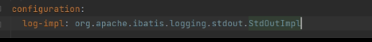

## 概述

> - 为简化而生，只做增强，不做改变，为简化开发，提高效率而生
> - 适用于单表查询
>   - 节省了大量单表的CRUD的时间
>   - 我只能说一句，太爽啦！！！！！
> - `BaseMapper` 接口提供了基本的 CRUD 方法，但你仍然可以在自定义复杂查询时，手动写 `Mapper` 方法，保持与数据库的清晰交互。
> - 官网：https://baomidou.com


## 特性

> - 无侵入
>   - 只做增强不做改变，引入他不会对工程有任何影响，丝滑
> - 强大的CRUD操作
>   - 内置通用mapper，通用service，仅通过少量配置即可完成单表的大部分CRUD操作
> - 支持Lambda形式调用
> - 内置分页插件
>   - 支持多种数据库
> - 内置全局拦截插件


## 基本使用

### 导入mybatisplus依赖

```xml
<dependency>
	<groupId>com.baomidou</groupId>
	<artifactId>mybatis-plus-boot-starter</artifactId>
   <version>3.5.7</version>
</dependency>
```

> - 尽量不要同时导入mybatis 和 mybatisPlus 
>   - mybatisPlus 内嵌了 mybatis 的依赖，无需再次导入依赖
>   - 版本不一致容易导致冲突
>

### 连接数据库

```yaml
spring:
  application:
    name: mp-quickstart
  datasource:
    driver-class-name: com.mysql.cj.jdbc.Driver
    url: jdbc:mysql://localhost:3306/mp
    username: root
    password: 123456
```

> - driver-class-name
>   - mysql5：com.mysql.jdbc.Driver
>   - mysql8：com.mysql.cj.jdbc.Driver
>   - 高版本兼容低版本

### 定义Mapper

> - 自定义 Mapper 继承 MybatisPlus 提供的 BaseMapper<T> 接口
> - MybatisPlus 是无侵入的，继承接口后不影响原方法执行
> - 范型 - <T> -  传的是User
>   - 本质是User连接的@TableName("tb_user")连接的那张表tb_user
>   - 将该实体类和数据库tb_user映射关联

```
public interface Usermapper extends BaseMapper<User> {

}
```

> - 于是继承了父接口的一堆方法


### 扫描器

> - 在启动类上标注 @MapperScan("com.itheima.mp.mapper")
> - 或者在接口上加 @Mapper


###  配置日志

```
#控制台日志
mybatis-plus:
  configuration:
    log-impl: org.apache.ibatis.logging.log4j2.Log4j2AbstractLoggerImpl
```

## CRUD

### insert

> - 自动生成ID
>   - 数据库插入id的默认值为全局唯一ID

#### 主键的生成策略

> - 雪花算法（snowflake）
>   - 分布式ID算法生成器
>   - 结果是一个Long型的ID
>   - 可以保证几乎全球唯一
> - UUID
>   - 没有排序，太长了
> - 自增ID
>   - 一主多从，读写分离时会出现故障
>   - 在实体类ID上增加@TableId（type = IdType.AUTO）
>     - 数据库的字段一定要是自增的，否则会报错

### update

####　**通过条件动态拼接SQL**

#### 自动填充

> - 概述
>
>   - 创建时间，修改时间，自动化完成
>
> - 实现
>
>   - 在实体类中，使用 `@TableField` 注解来标记哪些字段需要自动填充，并指定填充的策略
>
>     -  @TableField ( )
>
>     - fill属性 -- 自动填充策略
>
>       ```java
>       public enum FieldFill {
>           //
>           DEFAULT,
>           //插入时更新
>           INSERT,
>           //更新的时候更新
>           UPDATE,
>           //插入和更新的时候更新
>           INSERT_UPDATE;
>       
>           private FieldFill() {
>           }
>       }
>       ```
>
>       
>
>   - 实现 MetaObjectHandler，编写处理器来处理这个策略
>
>     - 创建一个类来实现 `MetaObjectHandler` 接口，并重写 `insertFill` 和 `updateFill` 方法
>
>       ```java
>       @Component
>       public class MyMetaObjectHandler implements MetaObjectHandler {
>       
>           @Override
>           public void insertFill(MetaObject metaObject) {
>               log.info("开始插入填充...");
>               this.strictInsertFill(metaObject, "createTime", LocalDateTime.class, LocalDateTime.now());
>           }
>       
>           @Override
>           public void updateFill(MetaObject metaObject) {
>               log.info("开始更新填充...");
>               this.strictUpdateFill(metaObject, "updateTime", LocalDateTime.class, LocalDateTime.now());
>           }
>       }
>       ```
>
>   
>
>   - 配置自动填充处理器
>     - 确保 `MyMetaObjectHandler` 类被 Spring 管理
>       - 通过 `@Component` 或 `@Bean` 注解来实现。

### 乐观锁

> - 

### select

### delete

## 常用注解

### @TableName("tb_user")


###　@TableId（type = IdType.NONE）

```java
public @interface TableId {
    String value() default "";

    IdType type() default IdType.NONE;
}

```

> - type参数为枚举类型

**IdType类型**

```Java
public enum IdType {
    //自增
    AUTO(0),
    //不使用
    NONE(1),
    //手动输入，
    //此时ID值为null，需要手动写ID
    INPUT(2),
    //默认全局ID
    ASSIGN_ID(3),
    //全局唯一ID
    ASSIGN_UUID(4);

    private final int key;

    private IdType(int key) {
        this.key = key;
    }

    public int getKey() {
        return this.key;
    }
}
```


###  @TableField ("user_name")

> - l驼峰
> -  /* 起别名--绑定 */

```
  @TableField ("user_name")
   	 private String userName;
```

## 全局配置

> - #全局配置
>   #所有的实体类
>   mybatis-plus:
>     global-config:
>       db-config:
>         #:前缀
>         table-prefix: tb_
>         #
>         id-type: auto


## 条件构造器 -- Wrapper


## 分页及拦截器


## 自定义

> - `BaseMapper` 接口提供了基本的 CRUD 方法，但你仍然可以在自定义复杂查询时，手动写 `Mapper` 方法，保持与数据库的清晰交互。





