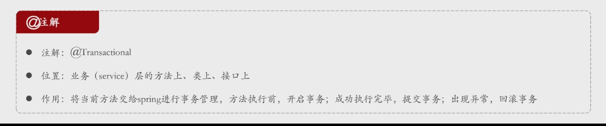
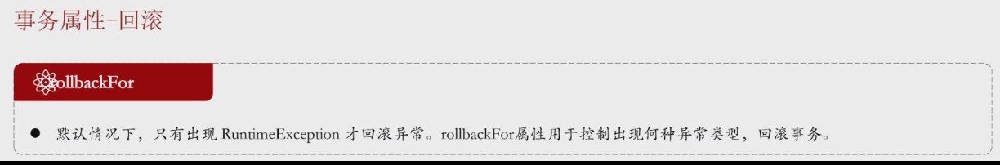
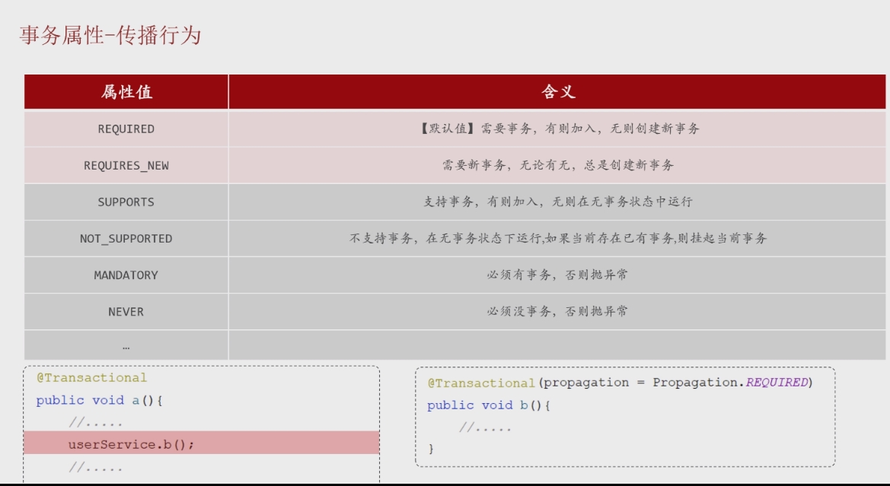

## 事物

> - 概述
>   - 一组操作的集合，是一个不可分割的工作单位
>   - 要么同时成功，要么同时失败 (生死与共)
>   - 最小的控制单元来使用的
> - 四大特性
>   - 原子性：整体不可分割
>   - 一致性：数据必须处于一致状态
>   - 隔离性：事务和事务之间是彼此隔离的
>   - 持久性：事物处理的结果都是永久的


## 实现方式

### 编程式事务管理

> - 概述
>   - Spring 提供了 `PlatformTransactionManager` 接口来进行编程式事务管理。
> - 实现步骤 
>   - 开启事务 --- 获取事务管理器
>     - 在编程式事务管理中，开启事务不需要显式的命令行语句或数据库命令。
>     - 事务的开启通过调用 `transactionManager.getTransaction()` 来实现，它会隐式地开启一个新的事务
>     -  TransactionStatus status = transactionManager.getTransaction(null); // 使用默认事务设置
>   - 提交事务
>     - transactionManager.commit(status);
>   - 回滚事务
>     - transactionManager.rollback(status);


#### 默认事务设置代码实现

```java
@Service
public class TransactionalService {

    //注入事务实例
    @Autowired
    private PlatformTransactionManager transactionManager;

    public void executeTransaction() {
        
        // 获取一个事务
        TransactionStatus status = transactionManager.getTransaction(null); // 使用默认事务设置
        
        try {
            // 在事务中执行一些操作
            System.out.println("开始执行事务操作...");
            
            // 模拟数据库操作
            // userRepository.save(user); (此处为模拟操作)

            // 模拟成功时提交事务
            transactionManager.commit(status);
            System.out.println("事务提交成功");
        } catch (RuntimeException e) {
            // 发生异常时回滚事务
            transactionManager.rollback(status);
            System.out.println("事务回滚");
            throw e; // 抛出异常以通知调用方
        }
    }
}
```


#### 设置事务属性

> - `DefaultTransactionDefinition` 
>   - 用于定义事务的属性，比如事务传播行为
>   - `PROPAGATION_REQUIRED` 表示如果当前没有事务，就创建一个新的事务
> - **获取事务状态**：
>   - `transactionManager.getTransaction(def)` 用于手动开启事务，并返回事务状态对象 `TransactionStatus`。


#### 实现

```java
@Service
public class UserService {

    @Autowired
    private UserRepository userRepository;

    @Autowired
    private PlatformTransactionManager transactionManager;

    // 手动管理事务
    public void createUserWithTransaction(User user) {
        // 定义事务
        DefaultTransactionDefinition def = new DefaultTransactionDefinition();
        def.setName("UserCreationTransaction");
        def.setPropagationBehavior(TransactionDefinition.PROPAGATION_REQUIRED);

        // 获取事务状态
        TransactionStatus status = transactionManager.getTransaction(def);
        
        try {
            // 执行数据库操作
            userRepository.save(user);
            
            // 模拟异常
            if (user.getName().equals("error")) {
                throw new RuntimeException("Simulated error");
            }

            // 提交事务
            transactionManager.commit(status);
        } catch (RuntimeException e) {
            // 发生异常，回滚事务
            transactionManager.rollback(status);
            throw e;  // 重新抛出异常，通知上层
        }
    }
}
```


### 注解式事务管理




#### 概述

> -  **最好用在接口的方法上**
>    -  接口的所有实现类全部被事物管理
>    -  **方法级别的粒度控制**
>       使用 `@Transactional` 注解在接口的方法上可以更好地控制事务的粒度。有些方法可能需要事务，而有些方法不需要，将注解放在方法级别可以灵活地配置不同的事务管理需求。
>    -  **明确业务逻辑需求**
>       将 `@Transactional` 注解放在方法上可以使事务管理的范围更加明确，代码也更加清晰，尤其当一个类中有多个方法时，你可以根据每个方法的需求决定是否需要事务。


#### 使用场景

> - 一个业务中多个DML操作时
> - 删除部门时，将员工也删掉
>   - 程序运行中抛出了异常，部门删除但是员工却没有，造成了数据不一致

```java
   @Transactional
    @Override
    public void removeById(Integer id) {
        //1、调用部门dao，删除dept
        deptDao.removeByID(id);
        //2、调用员工dao，删除员工
        empDao.deleteByDeptId(id);
    }

```


## 事务失效




> - 通过 **roolbackFor** 设置回滚的异常类型

```java
  @Transactional( rollbackFor = Exception.class )
    @Override
    public void removeById(Integer id) {
        //1、调用部门dao，删除dept
        deptDao.removeByID(id);
        //2、调用员工dao，删除员工
        empDao.deleteByDeptId(id);
    }

```


## 事物传播

### 概述

> - 一个事物被另一个事物调用，被调用事物的不同态度产生了不同的结果
> - 默认状态：有就加入，无则创建





### 应用场景

> - 解散部门不论是否成功 都记录日志
>   - 此时记录日志的事务就该选择 REQUIRES_NEW，独立


```java
 @Transactional()
    @Override
    public void removeById(Integer id) {
        try {
            //1、调用部门dao，删除dept
            deptDao.removeByID(id);
            //2、调用员工dao，删除员工
            empDao.deleteByDeptId(id);
        } catch (Exception e) {
            throw new DelDeptErrorException("删除部门失败");
        } finally {
            //3、无论是否成功都记录日志
            DeptLog deptLog = new DeptLog(id,LocalDateTime.now(),"执行了解散部门操作");
            deptLogService.insert(deptLog);
        }
    }
```


```java
@Service
public class DeptLogServiceImpl implements DeptLogService {

    @Autowired
    private DeptLogMapper deptLogMapper;

    @Transactional(propagation = Propagation.REQUIRES_NEW)
    @Override
    public void insert(DeptLog deptLog) {
        deptLogMapper.insert(deptLog);
    }
}
```


## 配置控制台事务日志显示

```yaml
#开启spring事务管理日志
logging:
  level:
    org.springframework.jdbc.support.JdbcTransactionManager: debug
```
