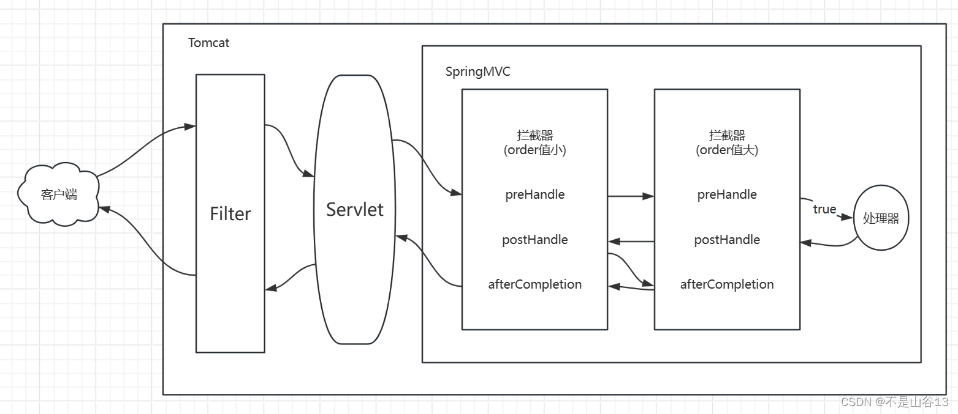

## 概述

> - 拦截器是 **Spring** 框架提供的核心功能之一，允许开发人员提前预定义一些逻辑，在用户的请求、响应前后执行。
> - 也可以在用户请求前阻止其执行或者在请求完成之后做一些资源释放。
> - 在 Spring Boot 中，**需要将拦截器注册到 Spring 的配置中**
> - 注册拦截器意味着将你自定义的拦截器添加到 Spring 的上下文中，以便在请求到达控制器之前和之后执行特定的逻辑。

## 注册拦截器的步骤

> - **创建拦截器**： 你首先需要创建一个实现 `HandlerInterceptor` 接口的类，定义 `preHandle`、`postHandle` 和 `afterCompletion` 方法。
> - **创建配置类**： 你需要创建一个配置类，实现 `WebMvcConfigurer` 接口。在这个配置类中，你可以注册自定义的拦截器。
> - **添加拦截器**： 在配置类中重写 `addInterceptors` 方法，将拦截器添加到拦截器注册表中。

## 拦截器基本流程

> - ### 流程逻辑
>
>   - **请求到达服务器**：客户端发送请求到服务器。
>   - **进入拦截器的  preHandle  方法**
>     - 你可以在这里添加逻辑，比如检查用户身份或权限。
>     - 如果条件不满足（如未提供令牌），可以发送错误响应并返回 `false`，拦截请求。
>     - 如果条件满足，返回 `true`，继续处理请求。
>   - **请求到达控制器**：请求被发送到对应的控制器方法。
>   - **控制器处理请求**：控制器执行逻辑，处理完后返回响应。
>   - **进入 postHandle 方法**：请求处理完成后，但在视图渲染之前，可以在这里添加额外的逻辑。
>   - **视图渲染**：生成响应视图。
>   - **进入 afterCompletion 方法**：请求完成后执行，可进行清理操作，比如日志记录。