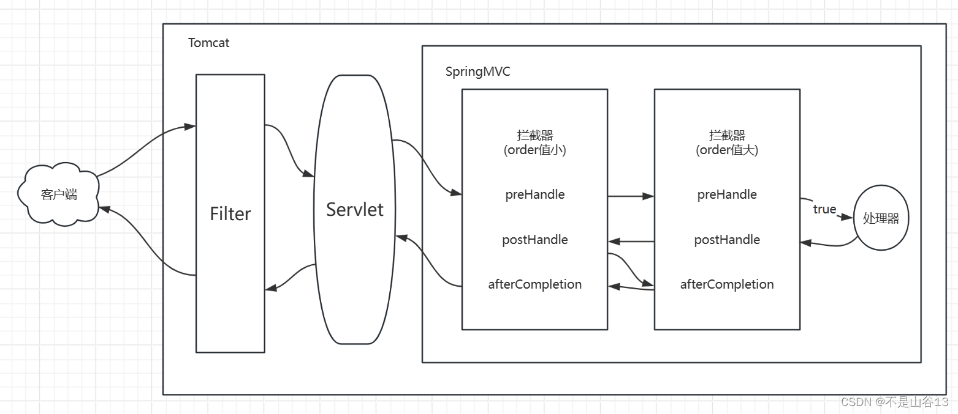
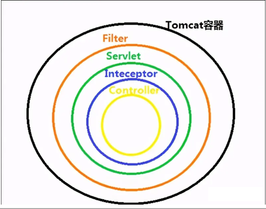
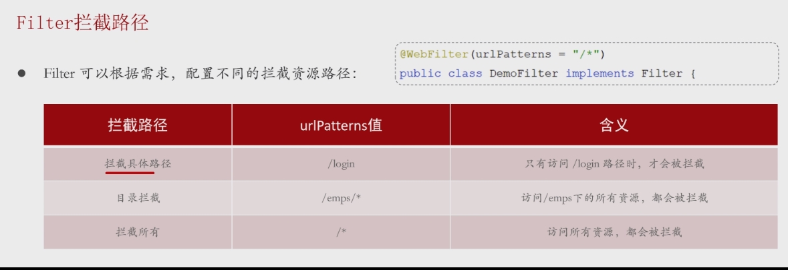
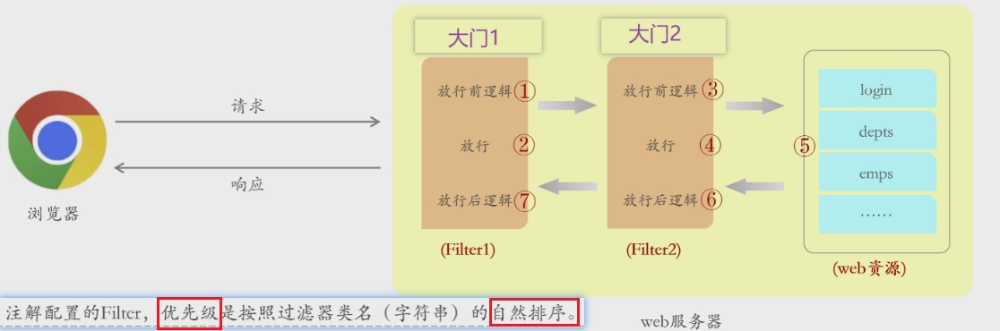

## 概述




> - Java Web 三大组件之一（Servlet、Filter、Listener）
>
> - **Tomcat提供**
>- 框架还未执行到，**无法自动封装，需手动处理request和response**
>     - 登录校验
>     - 统一的编码处理
>   
>- Java Servlet 技术中的一个重要部分，主要用于在   **Servlet 处理请求之前或响应之后**    一般完成一些通用操作
> 
>- **它随 web 应用启动而启动，只初始化一次**，以后就可以拦截相关请求。**只有当你的 web 应用停止或重新部署的时候才销毁**




## 过滤器实现

### 导入依赖

```xml
<dependency>
    <groupId>javax.servlet</groupId>
    <artifactId>javax.servlet-api</artifactId>
    <version>4.0.1</version> <!-- 或根据需要选择合适的版本 -->
</dependency>
```


### 添加@WebFilter(urlPatterns = " ")并实现 Filter

> - **@WebFilter**
>   - 用于定义 Servlet 过滤器的注解
>   - 它通常用于 Java EE 或 Jakarta EE 应用程序中，以对请求和响应进行预处理和后处理
> - **实现servelt的 Fitter **
> -  重写doFilter方法 ---- 核心
>   - 拦截请求后自动调用此方法
>   - 多次调用
>   - 放行操作很重要，要不然一直拦在那
>   - 令牌放在请求包
> - 三个参数
>   - ServletRequest servletRequest
>     - 表示客户端发送的请求
>   - ServletResponse servletResponse
>     - 表示将要发送给客户端的响应
>   - FilterChain filterChain
>     - 用于调用下一个过滤器或最终目标资源  --  例如servelt
>     - **如果不调用 doFilter，请求将不会继续传递**，可能导致后续的过滤器或 Servlet 不会被执行

```java
@WebFilter(urlPatterns = "/*")
public class FilterDemo1 implements Filter {
 
    @Override
    public void doFilter(ServletRequest servletRequest, ServletResponse servletResponse, FilterChain filterChain) throws IOException, ServletException {
        System.out.println("拦截到了请求");
        
        //放行 -- 将请求和响应传递给下一个过滤器或目标 Servlet
        //如果不调用 doFilter，请求将不会继续传递，可能导致后续的过滤器或 Servlet 不会被执行
        filterChain.doFilter(servletRequest,servletResponse);
 
    }
```


### 在启动类加上Servelt组件扫描器

> - **@ServletComponentScan**
>
> - **过滤器是Servelt组件，需要在引导类加上扫描器，否则识别不到**


## 拦截路径




## 执行流程

> 过滤前 -> 放行 -> 资源 -> 放行后


## 过滤器链

