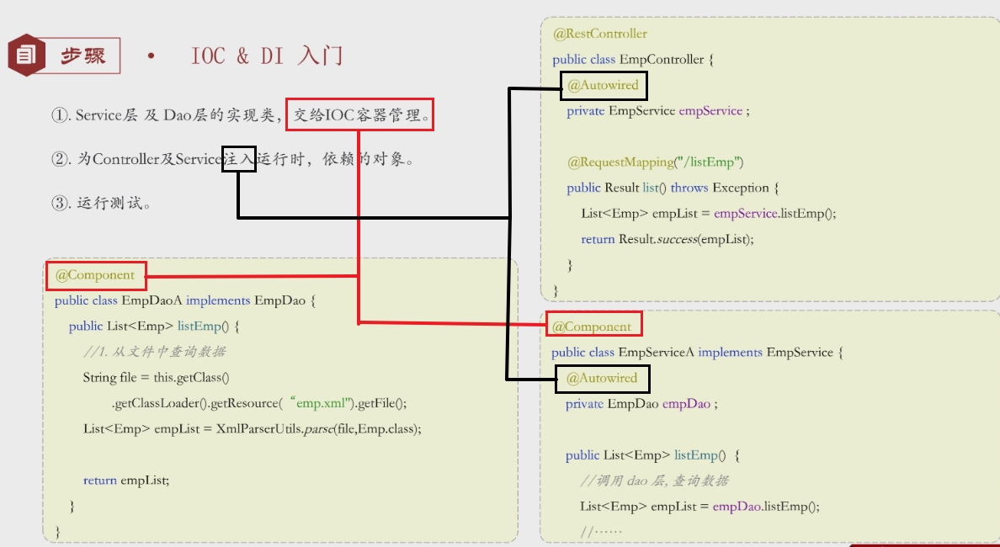

## 概述

> - 解耦

## IOC - 控制反转

### 概述

> - 创建对象的控制权由程序自身转移到外部容器
>
> - 面向接口编程实现解耦
>
>   类只依赖接口而不是具体实现，业务逻辑和实现细节被分离

### 实现

> - @Component
>   - 控制器类
>     - @Controller
>   - 业务类
>     - @Service
>   - 数据访问类
>     - @Repository

## DI - 依赖注入

### 概述

> - 容器为应用程序提供运行时所依赖的资源，称为依赖注入

###　实现

> - @Autowired

