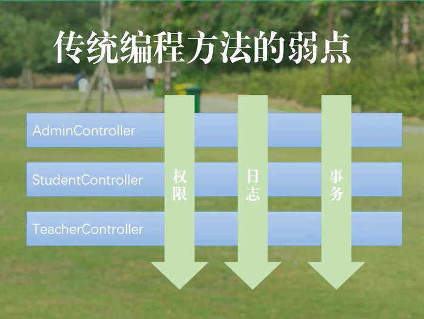
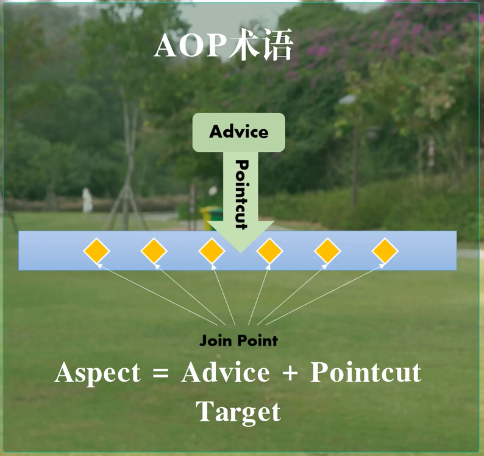
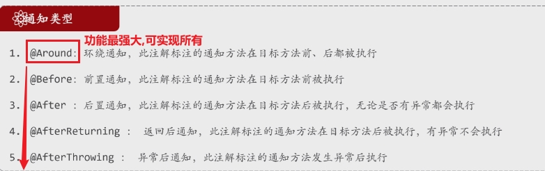

## 场景



> - 高内聚低耦合是我们所追求的终极目标，但其实无论怎样设计，诸如日志和权限校验这样的耦合问题在传统的面向对象编程中都无法处理，这些功能像沙子一样掺在我们的系统中间。
> - **无论是面向对象的方式还是面向过程的方式，他始终会留下一个点 - - 调用权限和调用日志的地方，也就是所谓的连结点，而筛选出的具体的链结点就是所谓的切点**
> - AOP 是解决这种问题最有效的方式，能将沙子从主业务中剥离出来

## 图像示例


## 概述

> - AOP（面向切面编程，Aspect-Oriented Programming）
> - Spring Aop 的底层是动态代理


## AOP术语




> - **Join Point** -- 连接点 --  where  -- 可以放沙子的点，
>
>   - 连接点**是指程序中　**所有可能被 AOP 拦截的点
>
>     
>
> - **Point Cut** -- 切点  --  是一个表达式，用于匹配特定的连接点，**是对连接点的定义或过滤**
>
>   - **简单来说，**切点用于选择谁是连接点
>     - **execution(\* com.example.service.\*.get\*(..))**：表示匹配 `com.example.service` 包中所有以 `get` 开头的方法。
>   - **@annotation(MyAnnotation)**：匹配带有 `MyAnnotation` 注解的方法。
>   
>   - 特点：
>   - 切点是一种**规则**，**用于选择连接点。**
>     - 切点定义了在哪些地方应用横切逻辑
>   
> - **切入点表达式**：定位切入点方法的表达式
>
>   - 匹配定义在哪些方法上应用切面
>     
>     - @Pointcut("execution(public * com.example.service.*.*(..))")
>   - 匹配带有特定注解的方法
>     
>     - @Pointcut("@annotation(com.example.annotation.Loggable)")
>   - 匹配指定类或包中的所有方法
>     
>     - @Pointcut("within(com.example.service.*)")
>   - 匹配代理对象或目标对象的特定类型的方法
>     - @Pointcut("this(com.example.service.UserService)"
>     
>     - @Pointcut("target(com.example.service.UserService)")
>     
>       
>
> - **Advice**  -- 通知/增强（重复的逻辑，共性的功能）-- 沙子
>
>   - do what -- 点的功能
>   - when -- 点的前后
>   - 5种通知方式
>     - @Before
>     - @After
>     - @Around 
>     - @AfterThrowing
>     - @AfterReturning
>
> - **Aspect**  --  **切面 = 切入点＋通知**　－＞　where + when + do what
>
>   
>
> - **Target** -- 目标对象：切入点所归属的对象，也就要掺沙子的地方
>
> - **proxy** -- 代理对象：框架创建的proxy对象，执行切面相关方法


## AOP本质

> - SpringBoot 在创建Bean对象的时候不是直接把Bean对象注入到我们使用的地方，注入的是一个动态代理
> - 借此动态代理的机制来实现AOP的功能，将沙子掺在动态代理的头上
> - 也因此，AOP的切点主要是在方法上面


## 应用场景

> - 权限控制
> - 缓存控制
> - 审计日志
> - 异常处理
> - 分布式追踪
> - 数据持久化
> - 事务处理


## 简单实现流程


### 连接点

> - 连接点 
>   - 调用adduser方法的地方
>   -  public void addUser(){}

```java
public class UserService {
    public void addUser(String username) {
        System.out.println("用户 " + username + " 被添加。");
    }
}
```


### 导入依赖

```properties
 <dependency>
            <groupId>org.springframework.boot</groupId>
            <artifactId>spring-boot-starter-aop</artifactId>
 </dependency>
```


### **定义切面**：

> - 创建一个切面类，使用 @Aspect 注解标识，包含切入点和通知。

> - 切点： 
>   - @Pointcut("execution(* UserService.addUser(..))")
>   -  public void userAddPointcut( ) { }

> - 切面：
>   - @Aspect
>   - public class LoggingAspect ( ){ }

```java
@Aspect
public class LoggingAspect {
    
    @Pointcut("execution(* UserService.addUser(..))")
    public void userAddPointcut() {}

    @Before("userAddPointcut()")
    public void logBefore(JoinPoint joinPoint) {
        System.out.println("即将添加用户：" + Arrays.toString(joinPoint.getArgs()));
    }

    @After("userAddPointcut()")
    public void logAfter(JoinPoint joinPoint) {
        System.out.println("用户添加完成：" + Arrays.toString(joinPoint.getArgs()));
    }
}
```


### **定义切入点**：

> - 使用 @Pointcut 注解定义切入点，指定在哪些连接点（如方法调用）上应用切面。

```java
@Pointcut("execution(* UserService.addUser(..))")
public void userAddPointcut() {
    // 切点定义
}
```


### **定义通知**：

> - 使用 @Before、@After、@Around 等注解定义通知，指定在切入点前后或环绕执行的逻辑。

```java
 	@Before("userAddPointcut()")
    public void logBefore(JoinPoint joinPoint) {
        System.out.println("即将添加用户：" + Arrays.toString(joinPoint.getArgs()));
    }

    @After("userAddPointcut()")
    public void logAfter(JoinPoint joinPoint) {
        System.out.println("用户添加完成：" + Arrays.toString(joinPoint.getArgs()));
    }
```


### **配置 AOP**：

> - 在 Spring 配置中启用 AOP，可以在主类上添加 **@EnableAspectJAutoProxy** 注解，或在 XML 配置中进行相应设置。


## 切面类及切面方法

```java
@Slf4j
@Aspect  //标记为切面类
@Component   //交给容器
public class TimeCountAspect {

   
    //定位需要统计耗时的目标方法
    @Around("execution(* com.example.tlias_manger.service.impl.EmpServiceImpl.*(..))")
     
    //切片方法
    public Object readTime(ProceedingJoinPoint pjp) throws Throwable {
    
    //参数:ProceedingJoinPoint
    
        long start = System.currentTimeMillis();

        //代理方法,后续替换为目标方法
        Object result = pjp.proceed();

        long end = System.currentTimeMillis();
        
         log.info("耗时时间:{}",end-start);
        return result;
    }
}
```


## AOP通知



> - @Around 最强大,手动控制对象的执行位置也就是可以实现下边的所有


### JoinPoint/ProceedingJoinPoint

> - **获取方法执行时的相关信息**
>
>   - @Around只能用 ProceedingJoinPoint
>
>     - ProceedingJoinPoint  **允许你手动控制目标方法的执行**
>
>     - 所以你可以选择是否调用目标方法
>
>     - **proceedingJoinPoint.proceed();**
>
>       
>
>   - 其他四种只能用 JoinPoint（是ProceedingJoinPoint的父类型）
>
>     - `JoinPoint` 自动传递当前执行的方法的信息，不需要额外的激活步骤


### 通知类型实现

```java
@Aspect
@Component
public class Demo1 {

    //通知类型-前置通知
    @Before("execution(* com.example.tlias_manger.service.impl.DeptServiceImpl.listDept())")
    public void before(){
        System.out.println("前置");
    }

    //通知类型-后置通知-无论是否有异常
    @After("execution(* com.example.tlias_manger.service.impl.DeptServiceImpl.listDept())")
    public void after(){
        System.out.println("前置");
    }

    //通知类型-后置通知-异常不执行
    @AfterReturning("execution(* com.example.tlias_manger.service.impl.DeptServiceImpl.listDept())")
    public void afterReturning(){
        System.out.println("前置");
    }

    //通知类型-异常后通知
    @AfterThrowing("execution(* com.example.tlias_manger.service.impl.DeptServiceImpl.listDept())")
    public void afterThrowing(){
        System.out.println("前置");
    }

    //通知类型-环绕通知
    @Around("execution(* com.example.tlias_manger.service.impl.DeptServiceImpl.listDept())")
    public void around(ProceedingJoinPoint pjp){//代理对象

        try {
            System.out.println("前置环绕");
            Object proceed = pjp.proceed();//手动执行目标方法
            System.out.println("后置环绕");
        } catch (Throwable e) {
            e.printStackTrace();
        }
    }
}
```


## 存在多个切面时

> - 切面增强按照自然排序 -- 切面类名称abcde……的顺序
> - 目标方法只执行以便


## AOP切点入表达式


### execution(...)

> -  **条件连接符及通配符**
>
>   - 逻辑条件：||，＆＆
>   - 通配符：
>     - **“*”**：匹配任意字符，但只表示一个字符
>     - **“..”**：匹配任意层的包名或参数
>       - 包名：execution(* com.example..*.*(..))
>       - 参数：execution(* com.example.service.OrderService.find*(..))
>
> - " ? "
>
>   - 代表可以省略
>
>   
>
> - 常用切点表达式
>
>   - execution(       *         com.example.service.      ORderService.      find *(..)        )
>
>   


### @annotation(...)

> - 自定义注解

```java
@Target(ElementType.METHOD) // 该注解可以用在方法上
@Retention(RetentionPolicy.RUNTIME) // 运行时可用
public @interface LogExecution {
    String value() default ""; // 可选的描述信息
}
```


> - 使用自定义注解标记目标方法

```java
public class UserService {
    
    @LogExecution("Adding a user")
    public void addUser(String username) {
        System.out.println("用户 " + username + " 被添加。");
    }
}
```


> - 创建切面类，通过 `@Pointcut` 来指定要拦截的方法。
> - 使用 `@Around`、`@Before`、`@After` 等注解来标识不同类型的通知

```java
@Aspect
@Component
public class LoggingAspect {

    @Pointcut("@annotation(logExecution)") // 拦截带有 @LogExecution 注解的方法
    public void logPointcut(LogExecution logExecution) {}

    @Around("logPointcut(logExecution)") // 在切点执行前后执行通知
    public Object logAround(ProceedingJoinPoint joinPoint, LogExecution logExecution) throws Throwable {
        System.out.println("开始执行方法: " + joinPoint.getSignature().getName() + " - 描述: " + logExecution.value());
        
        Object result = joinPoint.proceed(); // 执行目标方法
        
        System.out.println("方法执行完成: " + joinPoint.getSignature().getName());
        return result;
    }
}
```


### 抽取公共的切入点表达式


## 最终版

> - 运用逻辑条件缩小范围，精确定位


## Java是OOP的，为什么会选用AOP来实现切面？

> AOP（面向切面编程，Aspect-Oriented Programming）和 OOP（面向对象编程，Object-Oriented Programming）实际上是互补的编程范式．AOP 并没有取代 OOP 的概念，而是为了解决 OOP **难以处理的一些横切关注点问题**
>
> - 难以处理
>   - AOP 是为了处理一些与核心业务逻辑无关的、  **横切系统**   的关注点 , 提供了一种将横切关注点与业务逻辑完全分离的方式。
>   - 横切关注点指的是那些跨越多个模块、类或方法的功能需求，例如日志记录、事务管理、安全检查等。这些需求往往  **不属于系统的核心业务逻辑，而是“辅助”功能。**
>   - 横切关注点通常会影响多个类、模块和方法，而这些类和方法之间的关联可能并不明显
>
> **为什么不使用接口?**
>
> - 接口局限性
>   - **增加类的复杂度**：
>     - 如果使用接口来处理这些横切关注点，就需要将这些接口和逻辑明确地添加到每个相关的类中。
>     - 这样做虽然表面上可以解决问题，但每个类都需要实现这些接口，导致类的职责变得不单一，违背了“单一职责原则”，耦合度增加。
> - AOP 的优势：                                                     
>   - 代码无入侵
>     - 不修改的情况下进行   功能增强
>   - 集中式管理横切关注点：
>     - 所有横切关注点可以集中在一个地方管理，修改时不需要遍历每个类。
>   - 更少的代码重复
>   - 每个类都需要实现相同的接口方法，导致代码重复，维护困难。
>   - AOP 则可以通过定义切面（Aspect）来统一处理，这样所有相关的类都可以通过切入点（Pointcut）共享相同的功能，避免了代码重复。


## AOP比注解更偏底层一点吗?

> 是的，从设计层次上看，AOP（面向切面编程）确实可以被认为比注解更“底层”一些，主要体现在以下几个方面：
>
> - **AOP 是实现增强的机制**：
>   - AOP 本身是一种用于定义和实现横切关注点的编程方式，它通过切面（Aspect）、切入点（Pointcut）、通知（Advice）等机制，在运行时或编译时对目标方法进行增强。
>   - AOP 可以通过字节码操作、代理模式等底层技术来拦截方法调用并执行增强逻辑。
> - **注解是标记而非增强逻辑本身**
>   - 它用来标记代码中的增强点 , 注解本质上是一种元数据，用来为代码元素（如类、方法、字段）提供额外的信息。
>   - 注解本身不包含增强逻辑，它通常是声明性地告诉系统在哪里应该应用某种增强行为。底层的增强逻辑依赖于 AOP 或其他机制来实现。
>
> 