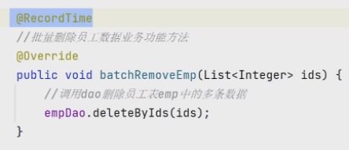

## 概述

> - AOP（面向切面编程，Aspect-Oriented Programming）
> - 面向切面编程，通过预编译方式和运行期动态代理实现程序功能的统一维护的一种技术。
> - SpringAop的底是动态代理
> - 通俗理解
>   - 切面像是喂食，给状态为饿的人，统一管理喂食


##  图像示例


## 简单实现流程

### 导入依赖

```properties
 <dependency>
            <groupId>org.springframework.boot</groupId>
            <artifactId>spring-boot-starter-aop</artifactId>
 </dependency>
```

### 切面类及切面方法

```java
@Slf4j
@Aspect  //标记为前面类
@Component   //交给容器
public class TimeCountAspect {

   
    //定位需要统计耗时的目标方法
    @Around("execution(* com.example.tlias_manger.service.impl.EmpServiceImpl.*(..))")
     
    //切片方法
    public Object readTime(ProceedingJoinPoint pjp) throws Throwable {
    
    //参数:ProceedingJoinPoint
    
        long start = System.currentTimeMillis();

        //代理方法,后续替换为目标方法
        Object result = pjp.proceed();

        long end = System.currentTimeMillis();
        
         log.info("耗时时间:{}",end-start);
        return result;
    }
}
```


## Java是OOP的，为什么会选用AOP来实现切面？

> AOP（面向切面编程，Aspect-Oriented Programming）和 OOP（面向对象编程，Object-Oriented Programming）实际上是互补的编程范式．AOP 并没有取代 OOP 的概念，而是为了解决 OOP **难以处理的一些横切关注点问题**
>
> - 难以处理
>   - AOP 是为了处理一些与核心业务逻辑无关的、  **横切系统**   的关注点 , 提供了一种将横切关注点与业务逻辑完全分离的方式。
>   - 横切关注点指的是那些跨越多个模块、类或方法的功能需求，例如日志记录、事务管理、安全检查等。这些需求往往  **不属于系统的核心业务逻辑，而是“辅助”功能。**
>   - 横切关注点通常会影响多个类、模块和方法，而这些类和方法之间的关联可能并不明显
>
> **为什么不使用接口?**
>
> - 接口局限性
>   - **增加类的复杂度**：
>     - 如果使用接口来处理这些横切关注点，就需要将这些接口和逻辑明确地添加到每个相关的类中。
>     - 这样做虽然表面上可以解决问题，但每个类都需要实现这些接口，导致类的职责变得不单一，违背了“单一职责原则”，耦合度增加。
> - AOP 的优势：                                                     
>   - 代码无入侵
>     - 不修改的情况下进行   功能增强
>   - 集中式管理横切关注点：
>     - 所有横切关注点可以集中在一个地方管理，修改时不需要遍历每个类。
>   - 更少的代码重复
>    - 每个类都需要实现相同的接口方法，导致代码重复，维护困难。
>     - AOP 则可以通过定义切面（Aspect）来统一处理，这样所有相关的类都可以通过切入点（Pointcut）共享相同的功能，避免了代码重复。


## AOP比注解更偏底层一点吗?

> 是的，从设计层次上看，AOP（面向切面编程）确实可以被认为比注解更“底层”一些，主要体现在以下几个方面：
>
> - **AOP 是实现增强的机制**：
>   - AOP 本身是一种用于定义和实现横切关注点的编程方式，它通过切面（Aspect）、切入点（Pointcut）、通知（Advice）等机制，在运行时或编译时对目标方法进行增强。
>   - AOP 可以通过字节码操作、代理模式等底层技术来拦截方法调用并执行增强逻辑。
> - **注解是标记而非增强逻辑本身**
>   - 它用来标记代码中的增强点 , 注解本质上是一种元数据，用来为代码元素（如类、方法、字段）提供额外的信息。
>   - 注解本身不包含增强逻辑，它通常是声明性地告诉系统在哪里应该应用某种增强行为。底层的增强逻辑依赖于 AOP 或其他机制来实现。
>
> 


## 基本概念

> - 连接点：**连接点**是指程序中　**所有可能被 AOP 拦截的点**
> - 切入点：**切入点**是对连接点的定义或过滤。简单来说，**切入点用于选择你关心的连接点**。
>   - 在 Spring AOP 中，一个切入点可能是：
>     - **execution(\* com.example.service.\*.get\*(..))**：表示匹配 `com.example.service` 包中所有以 `get` 开头的方法。
>     - **@annotation(MyAnnotation)**：匹配带有 `MyAnnotation` 注解的方法。
>   -  特点：
>     - 切入点是一种**规则**，用于选择连接点。
>     - 切入点定义了在哪些连接点上应用横切逻辑
>
> 
>
> - 切入点表达式：定位切入点方法的表达式
> - 通知：重复的逻辑，共性的功能
> - 切面：切入点＋通知　－＞　ｗｈｏ＋ｗｈｅｎ＋ｗｈａｔ
> - 目标对象：切入点所归属的对象
> - 代理对象：框架创建的proxy对象，执行切面相关方法


## AOP通知类型


> - @Around 最强大,手动控制对象的执行位置也就是可以实现下边的所有


### 通知类型实现

```java
@Aspect
@Component
public class Demo1 {

    //通知类型-前置通知
    @Before("execution(* com.example.tlias_manger.service.impl.DeptServiceImpl.listDept())")
    public void before(){
        System.out.println("前置");
    }

    //通知类型-后置通知-无论是否有异常
    @After("execution(* com.example.tlias_manger.service.impl.DeptServiceImpl.listDept())")
    public void after(){
        System.out.println("前置");
    }

    //通知类型-后置通知-异常不执行
    @AfterReturning("execution(* com.example.tlias_manger.service.impl.DeptServiceImpl.listDept())")
    public void afterReturning(){
        System.out.println("前置");
    }

    //通知类型-异常后通知
    @AfterThrowing("execution(* com.example.tlias_manger.service.impl.DeptServiceImpl.listDept())")
    public void afterThrowing(){
        System.out.println("前置");
    }

    //通知类型-环绕通知
    @Around("execution(* com.example.tlias_manger.service.impl.DeptServiceImpl.listDept())")
    public void around(ProceedingJoinPoint pjp){//代理对象

        try {
            System.out.println("前置环绕");
            Object proceed = pjp.proceed();//手动执行目标方法
            System.out.println("后置环绕");
        } catch (Throwable e) {
            e.printStackTrace();
        }
    }
}
```


### 同类型优先级

> - 自然排序


## AOP底层-代理

> - 动态代理
>   - jdk：代理对象和被代理对象同时实现通过一个接口
>   - cglib：被代理对象是代理对象的父类


## AOP切点入表达式

### 两种形式

#### execution(...)


#### @annotation(...)

> - 自定义注解


> - 标记目标方法




> - 创建切面类并使用annotation扫描注解的方式


### 多条件

> - 逻辑条件：||，＆＆
> - 通配符：
>   - ＊：匹配任意字符，但只表示一个字符
>   - ．．：匹配任意层的包名或参数
>     - 包名：execution(* com.example..*.*(..))
>     - 参数：execution(* com.example.service.OrderService.find*(..))


### 抽取公共的切入点表达式


## 最终版

> - 运用逻辑条件缩小范围，精确定位


## 动态代理

> - 程序为什么需要代理？代理长什么样子
> - 对象如果嫌自己做的事太多，可以通过代理转移部分职责
> - 对象有什么方法想被代理，代理就一定要有对应的方法
> - 
> - 中介公司如何知道要派有唱歌、跳舞方法的代理呢？
>   - 接口定义要代理的方法
>   - 代理的实现类去实现具体的方法