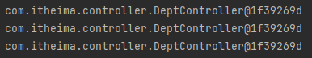
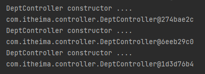
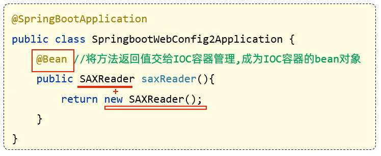
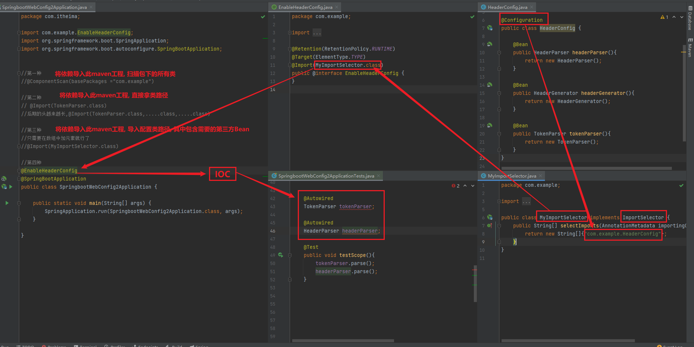

## 获取Bean流程

### 1、拿到IOC容器对象

> - **ApplicationContext**
>   - 是 Spring 框架中的核心接口之一，它负责管理 Spring 容器中的所有 bean

```java
 //获取IOC容器对象
    @Autowired
    private ApplicationContext applicationContext;
```


### 2、获取Bean对象

> - 三种方法
> - bean名称：返回值是Object对象
>   - **默认值为类名首字母小写**
>   - 需手动强转
> - bean名称+类路径：返回值自动强转为bean对象
> - 类路径：返回值为bean对象

```java
 		//名字
        DeptController bean = (DeptController) applicationContext.getBean("deptController");
        System.out.println(bean);

        //类型
        DeptController bean1 = applicationContext.getBean(DeptController.class);
        System.out.println(bean1);


        //名字,带类型转换
        DeptController bean2 = applicationContext.getBean("deptController", DeptController.class);
        System.out.println(bean2);

```


### **ApplicationContext** 详解

> - 概述
>   - 是 Spring 框架中的核心接口之一，它负责管理 Spring 容器中的所有 bean，并提供了更强大的功能
> - 职责
>   - Bean管理
>     - 负责创建，配置和管理Spring容器的所有bean
>     - 根据Spring配置文件（xml）或注解（@component）加载bean定义，并提供getBean（）方法
>     - getBean（）方法来源自`BeanFactory` ，ApplicationContext是BeanFactory的强化版本
>   - 依赖注入
>     - 会处理对象间依赖关系，并根据bean配置自动注入依赖
>   - 事件发布与监听
>     - 提供了事件传播功能，允许发布自定义事件（ApplicationContext）和监听事件（ApplicationListener）
>     - 例如：当容器启动或者关闭时，可以监听特定事件并触发相应操作


## bean作用域

> - @Scope：配置作用域
>   - singleton：单例，默认，容器启动时创建
>   - 
>   - prototypr：每次使用该bean时都会创建一个新实例
>   - 
> - @Lazy：延迟初始化（懒加载）
>   - 什么么时候用，什么时候初始化
>   - 只实例化一次


## 第三方bean--@Bean

### 概述

> - 在 Spring Boot 项目中，如果你需要引入第三方库或模块提供的组件，这些  **第三方类**  通常不是由你自己编写的，而是来自外部依赖
>
> - 为了使这些第三方类能够被 Spring 容器管理并使用，你通常需要将它们定义为 Spring 的 Bean

### 使用方式

> - 以前：导入依赖，使用对象，每次都要创建一个对象浪费资源
> - 现在：交给IOC，进行依赖注入
>   - 但其属于第三方，所以是无法使用@Component及衍生注解声明bean的，需要使用@Bean注解


### 注入实现--启动类（不推荐）

> - 在启动类内实现
>   - 能在启动类实现的原因是因为启动类是个配置类
>   - 注解@SpringBootApplication内含有@configuration
>   - 会将其返回值（对象）交给IOC处理



### 配置类+扫描器  - -  含@Bean方法

#### @Bean + @Configuration

> - 概述
>   - 用于**方法级别**的注解，可指定名称，默认是方法名
>   - 通常在**配置类**中使用，常配合 **@Configuration**，通过方法定义 Bean，Spring 会将该方法的返回值注册为一个 Bean。
>     - 必须要有返回值且必须是个对象
>   - 常用于**第三方库**或**不直接通过类注解的 Bean** 注册场景，或者需要更灵活地控制 Bean 的创建逻辑时。
> - **注意点**
>   - 一定要有返回值且需要是对象 - - - 因此可以放到IOC中
>   - 如果第三方Bean还需要依赖其它bean对象，需要以 **传参** 的形式传递(容器里要有)，不能使用 @Autowired
>     - **通过外部会产生顺序问题---对象会有null的可能**


## Bean扫描规则

### 默认扫描范围

> - `ComponentScan` 默认会从启动类所在的包开始 **递归扫描** 该包及其所有子包，并将带有特定注解（如 `@Component`、`@Service`、`@Repository` 等）的类注册为 Spring 容器中的 Bean。
>
> - 如果你的不同模块使用相同的包结构，那么这些模块中的类也会被自动扫描并注册为 Spring 的 Bean。
>
> - 假设你的 Spring Boot 启动类位于 `com.example.app` 包下，启动类一般会被标注为 `@SpringBootApplication`
>
> - 这实际上等同于如下配置
>
>   - **@ComponentScan(basePackages = "com.example.app")**  -  -  -   包路径  
>
>   ```java
>   @SpringBootApplication
>   @ComponentScan(basePackages = "com.example.app")
>   public class MyApplication {
>       public static void main(String[] args) {
>           SpringApplication.run(MyApplication.class, args);
>       }
>   }
>   
>   ```
>
> - `@ComponentScan` 会从 `com.example.app` 包开始，递归扫描该包及其所有子包下的类，自动查找并注册所有带有组件注解的类。

#### 2. **跨模块扫描**

> 假设你有一个多模块项目，其中各个模块的包名结构保持一致，且正确引入了模块的依赖
>
> - **模块A**（启动类所在模块）：`com.example.app`
> - **模块B**（另一个模块）：`com.example.app.service`
>
> 即便 `com.example.app.service` 中的类不在启动类所在的模块中，由于它的包结构与 `com.example.app` 包是递归关系中的一部分，Spring Boot 依然会扫描到这个包。
>
> **它们都属于 `com.example.app` 的子包**
>
> 换句话说，只要模块 B 的包名是 `com.example.app.service`，Spring Boot 就会自动将其包含在扫描路径内。


#### 3、自定义扫描包范围 - - 模块管理配置类

> - **概述**
>
> 当应用程序功能复杂时，将所有的配置都写在一个地方会导致配置文件庞大且难以维护。使用 `@ComponentScan`、`@Import` 等注解，可以将配置类模块化，并根据需求动态加载不同模块的配置或组件。


> - **场景**:
>   - **多模块系统**：如微服务架构下的不同服务，每个服务都有各自的配置逻辑。你可以将这些配置类模块化，只有在需要时才加载相应的配置。
>   - **插件式系统**：在一个插件化的系统中，每个插件都有自己的配置和组件，通过 `@ComponentScan` 和 `@Import` 来动态注册插件相关的组件。


> - **@ComponentScan - - 批量扫描** - - @ComponentScan(basePackages ="com.example")
>   - @ComponentScan` 是 Spring 框架的注解，用于指定 Spring 在配置时自动扫描和注册带有诸如 `@Component`、`@Service`、`@Repository`、`@Controller` 等注解的类。
>   - **basePackages**: 指定要扫描的包，Spring 会在该包及其子包中寻找带有特定注解的类并将其注册为 Spring 容器中的 bean。
>   - 它可以放在任何配置类（带有 `@Configuration` 注解的类）上
>     - **只要 Spring 能够扫描并加载该配置类即可**，否则没意义
>   - 适用于需要批量加载某个包下的所有组件


> -  **@Import - - 扫描指定配置类**  - - @Import(TokenParser.class)
>   - 用来将指定的类、配置类或者 `ImportSelector` 引入到 Spring 容器中
>   - 通过 `@Import` 注解导入的类通常是一个 `@Configuration` 配置类，或是某些需要提前加载的 Spring 管理的 bean。


> - **@Import** **- -扫描数组（自定义选择器）** - - @Import( MyImportSelector.class )
>   - 如果传入的类实现了 `ImportSelector`，它允许你基于某些条件动态选择导入的类。
>   - ImportSelector` 的核心方法 `selectImports()`   **返回一个类的全路径名数组**  ，告诉 Spring 需要导入哪些类。
>
> 
>
> - **实现流程**
>   - 1、构造一个配置类，写入第三方Bean
>   - 2、构造一个实现 ImportSelector 接口的实现类
>   - 3、在实现类的核心方法 selectImports( ) 的返回数组  中加入 配置类的  **全限定名**（包路径+类名）
>   - 4、在@Import 后 加入实现类

```java
public class MyImportSelector implements ImportSelector {
    public String[] selectImports(AnnotationMetadata importingClassMetadata) {
        return new String[]{"com.example.HeaderConfig"};
    }
}

```


> - **两种@Import相比较**
>  - 扫描指定类的Import后期的头越来越长 , @Import(TokenParser.class,.....class,.....class)
>   - 实现接口的Import里面传入实现 了 ImportSelector 接口的实现类路径，配置路径在数组内添加，显得更优雅


### @EnableHeaderConfig  — **自定义注解** - -   **在包装一层**，在简化一下启动类上边的文字数量

> - **@Enable 类注解的原理**:
>  - 自定义的 `@Enable` 注解常常会结合 `@Import` 一起使用，通过 `@EnableXXX` 注解，用户可以简化某些功能的启用方式，比如 Spring 内置的 `@EnableScheduling`、`@EnableAsync` 等。
> - **用途**: 一般用于自定义模块化配置，类似于一个功能开关，通过一个注解即可启用特定的配置或功能。

> - 配置类

```java

@Configuration
//配置类
public class HeaderConfig {

    @Bean
    public HeaderParser headerParser(){
        return new HeaderParser();
    }

    @Bean
    public HeaderGenerator headerGenerator(){
        return new HeaderGenerator();
    }

    @Bean
    public TokenParser tokenParser(){
        return new TokenParser();
    }
}
```


> - ImportSelector 接口实现类

```java

public interface ImportSelector {
    String[] selectImports(AnnotationMetadata importingClassMetadata);

    @Nullable
    default Predicate<String> getExclusionFilter() {
        return null;
    }
}
```


> - 自定义注解

```java
@Retention(RetentionPolicy.RUNTIME)
@Target(ElementType.TYPE)
@Import(MyImportSelector.class)
public @interface EnableHeaderConfig {
}
```


> - 在启动类上加上自定义注解

```java
@EnableHeaderConfig
@SpringBootApplication
public class SpringbootWebConfig2Application {

    public static void main(String[] args) {
        SpringApplication.run(SpringbootWebConfig2Application.class, args);
    }

}

```





