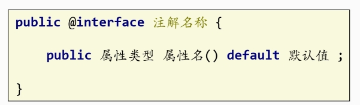

## 概述

> - 注解的本质其实是一种特殊的接口


## 自定义注解



> - 使用@interface 关键字
> - 只能包含元素（属性），并且可以指定默认值

```java
public @interface MyAnnotation {
    String value(); // 注解的属性
    int count() default 1; // 带默认值的属性
}
```


## 注解解析 -- 反射

### AnnotatedElement接口

> - `AnnotatedElement` 接口是 Java 反射机制的一部分。它定义在 `java.lang.reflect` 包中，专门用于提供对注解的访问
> - 所有可以被注解的元素（如类、方法、字段等）都实现了这个接口

#### 主要方法

> - **获取所有注解**
>
>   - **Annotation[] getAnnotations()**
>
>     - **描述：**返回该元素上所有的注解，包括父类继承的
>
>     - **返回值：**一个包含所有注解的数组，如果没有注解则返回空数组
>
>       
>
>   - **Annotation[] getDeclaredAnnotations()**
>
>     - **描述**：仅返回直接声明在该元素上的注解

> - **获取指定注解实例**
>   - **Annotation getAnnotation(Class<? extends Annotation> annotationClass)**
>     - **描述**：返回该元素上指定类型的注解。如果该元素上没有该注解，则返回 `null`。
>     - **参数**：一个 Class 对象，表示需要查找的注解类型。
>     - **返回值**：指定类型的注解实例，如果不存在则返回 `null`。

> - **判断是否有指定注解**
>   - **boolean isAnnotationPresent(Class<? extends Annotation> annotationClass)**
>     - **描述**：检查该元素上是否存在指定类型的注解。
>     - **参数**：一个 Class 对象，表示需要检查的注解类型。
>     - **返回值**：如果该元素上存在指定类型的注解，返回 `true`；否则返回 `false`。


```java
// 定义注解
@Retention(RetentionPolicy.RUNTIME)
@Target(ElementType.METHOD)
@interface MyAnnotation {
    String value();
}

// 使用注解的类
public class MyClass {
    @MyAnnotation(value = "Hello, Annotation!")
    public void myAnnotatedMethod() {
        // 方法逻辑
    }
}

// 注解解析类
public class AnnotationProcessor {
    public void processAnnotations() {
        
        // 获取 MyClass 类的所有声明方法（不包括父类）
        for (Method method : MyClass.class.getDeclaredMethods()) {
            // 使用 isAnnotationPresent() 检查是否存在特定注解
            if (method.isAnnotationPresent(MyAnnotation.class)) {
                // 获取注解实例
                MyAnnotation annotation = method.getAnnotation(MyAnnotation.class);
                // 提取注解的值
                String value = annotation.value();
                System.out.println("Method: " + method.getName() + ", Annotation value: " + value);
            }
        }
    }

    public static void main(String[] args) {
        new AnnotationProcessor().processAnnotations();
    }
}
```


## 获取注解信息

### 通过反射

```java
@Target(ElementType.METHOD)
@Retention(RetentionPolicy.RUNTIME)
public @interface MyAnnotation {
    //注解属性
    String value() default "测试" ;
}

```


```java
public class AnnotationStart {

    @MyAnnotation("注解赋值测试")
    public void test(){
    }
}
```


```java
public void test() throws NoSuchMethodException {
        AnnotationStart annotationStart = new AnnotationStart();
        annotationStart.test();

        /*反射获取注解信息*/
        Method method = annotationStart.getClass().getMethod("test");
    	//遍历查找存在注解的方法
        if (method.isAnnotationPresent(MyAnnotation.class)) {
            //获取此注解对象
            MyAnnotation annotation = method.getAnnotation(MyAnnotation.class);
            System.out.println(annotation.value());
        }
    }
```


## 获取信息并赋值

```java
public class AnnotationStart {
    String a = "";

    @MyAnnotation("注解赋值测试")
    public void test(){
        System.out.println(a);
    }

    public void process() {
        
        // 通过反射处理注解并赋值
        for (var method : this.getClass().getDeclaredMethods()) {   //循环遍历方法
            
            if (method.isAnnotationPresent(MyAnnotation.class)) {//目标方法
               
                MyAnnotation annotation = method.getAnnotation(MyAnnotation.class); //获取注解
                this.a = annotation.value(); // 动态赋值
                break; // 找到第一个就退出
            }
        }
    }
}
```


## 低耦合的动态赋值

> - **再套一层 -- 经典**

```java
//接口
public interface ValueAssigner {
    void assignValue(String value);
}

//实现类
public class MyValueAssigner implements ValueAssigner {
    //类属性
    private String myValue;

    @Override
    public void assignValue(String value) {
        this.myValue = value;
        System.out.println("Assigned value: " + myValue);
    }
}

//动态赋值
public class MyClass {
    @MyAnnotation("Dynamic Value")
    public void myMethod(ValueAssigner assigner) {
        for (var method : this.getClass().getDeclaredMethods()) {
            if (method.isAnnotationPresent(MyAnnotation.class)) {
                MyAnnotation annotation = method.getAnnotation(MyAnnotation.class);
                //获取注解值并赋值给类属性
                assigner.assignValue(annotation.value());
                break;
            }
        }
    }
}
```


## 自定义注解存储方法的间接实现

> - 自定义注解中只能定义元素（属性），不能直接存储方法或者类的实例

### 存储方法名

> - 可以在注解中存储方法的名称，在运行时通过反射获取方法

```java
@Retention(RetentionPolicy.RUNTIME)
public @interface MethodAnnotation {
    String methodName(); // 存储方法名
}
```


### 使用反射获取方法

> - 在运行时根据存储的方法名，通过反射查找并调用该方法

```java
public class MyClass {

    @MethodAnnotation(methodName = "sayHello")
    public void myMethod() {
        // 方法体
    }

    public void sayHello() {
        System.out.println("Hello, World!");
    }

    public void process() throws Exception {
        for (var method : this.getClass().getDeclaredMethods()) {
            if (method.isAnnotationPresent(MethodAnnotation.class)) {
                MethodAnnotation annotation = method.getAnnotation(MethodAnnotation.class);
                String methodName = annotation.methodName();
                
                // 通过反射获取方法并调用
                Method m = this.getClass().getMethod(methodName);
                m.invoke(this); // 调用方法, this为当前类MyClass的实例，作为参数传递给 invoke() 方法，是为了告诉反射系统在哪个对象上调用这个方法
            }
        }
    }
}
```

> - for ( var method : this . getClass( ) . getDeclaredMethods( ) )
>   - 增强 for 循环
>   - this . getClass( ) . getDeclaredMethods ( ) 获取的是一个包含所有声明的方法的数组
>   - 类型为Method，每个 `Method` 对象表示一个方法，包括其名称、返回类型、参数类型等信息。

> - method . isAnnotationPresent ( MethodAnnotation . class )
>   - 是 Java 反射 API 中 `Method` 类的一个方法，用于检查指定的注解是否存在于某个方法上
>   - 参数是为指定注解的类对象
>   - 返回值为布尔值


## 使用代理实现动态调用

### 定义注解

> - 使用该注解标识要绑定的方法

```java
@Retention(RetentionPolicy.RUNTIME)
public @interface BindMethod {
    String value(); // 存储要绑定的方法名
}
```


### 创建接口

> - 为了实现动态代理

```java
public interface MyInterface {
    void myMethod();
}
```


### 实现接口

> - 实现接口并使用注解

```java
public class MyClass implements MyInterface {

    @BindMethod("sayHello")
    public void myMethod() {
        // 方法体可以为空，自动调用sayHello
    }

    public void sayHello() {
        System.out.println("Hello, World!");
    }
}
```


### 创建 动态代理 处理器类

```java
public class MyInvocationHandler implements InvocationHandler {
    
    //创建被代理对象
    private final MyInterface instance;
	//处理器类有参构造方法
    public MyInvocationHandler(MyInterface instance) {
        this.instance = instance;
    }

    @Override
    public Object invoke(Object proxy, Method method, Object[] args) throws Throwable {
        // 在调用被注解的方法前后执行逻辑
        if (method.isAnnotationPresent(BindMethod.class)) {
            //获取指定类型注解
            BindMethod bindMethod = method.getAnnotation(BindMethod.class);
            //获取注解属性
            String methodName = bindMethod.value();

            // 获取绑定的方法
            Method toInvoke = instance.getClass().getMethod(methodName);
            
            //使用instance对象调用toInvoke方法
            toInvoke.invoke(instance);
        }

        return method.invoke(instance, args); // 调用原方法
    }
}
```

> - method.getAnnotation(BindMethod.class);
>   - 用于获取指定类型的注解


### 使用代理

> - 自动触发

```java
public class Main {
    public static void main(String[] args) {
        MyClass myClass = new MyClass();
        MyInterface proxy = (MyInterface) Proxy.newProxyInstance(
                MyClass.class.getClassLoader(),
                new Class[]{MyInterface.class},
                new MyInvocationHandler(myClass)
        );

        proxy.myMethod(); // 调用时会自动触发 sayHello()
    }
}
```


## 元注解

> - 修饰注解的注解


### 作用域 -- @Target

> - 需要传一个枚举类型的变量 -- ElementType
> - ElementType
>   - TYPE：
>     - 类、接口（包括注解类型）或枚举声明
>   - METHOD：
>     - 方法声明
>   - FIELD：
>     - 字段声明（包括枚举常量）
>   - CONSTRUCTOR：
>     - 构造方法
>   - ANNOTATION_TYPE
>     - 注解类型
>     - @Target和@Retention皆用此字段修饰
>   - PARAMETER
>     - 参数声明。


### 生命周期 -- @Retention

> - 需要传一个枚举类型的变量 -- RetentionPolicy
> - RetentionPolicy
>   - SOURCE
>     - 只在源代码中保留，编译时会被丢弃。
>   - CLASS
>     - 在编译时保留，但不会加载到 JVM 中
>   - RUNTIME
>     - 在运行时保留，可以通过  反射读取
>   - SOURCE < CLASS < RUNTIME


## 使用场景

> - **元数据**：提供类、方法、字段等的额外信息，便于框架或工具使用。
>
> - **编译时检查**：用于标识错误或不规范的代码，例如 `@Override`。
>
> - **运行时处理**：在运行时通过反射访问注解信息，执行特定逻辑。