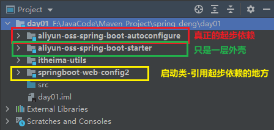
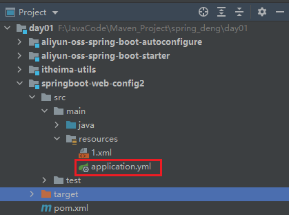
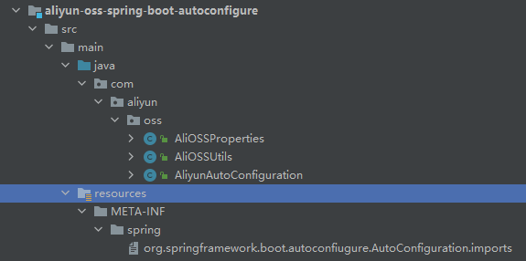

## 起步依赖（Starter Dependencies）

### 概述

> - 起步依赖是 Spring Boot 提供的一种便捷方式，通过包含一个依赖，自动引入该项目所需的所有依赖。这让开发者不必手动一个个地添加特定的库。
> - 本质就是一个maven坐标（maven项目对象模型），整合了一个功能需要的所有坐标（传递依赖）
> - springboot 的起步依赖原理是什么？


### 原理

> - pom.xml 
>   - <parent> 父依赖：<spring-boot-starter-parent> 
>   - 父依赖的<spring-boot-dependencies> 定义了大量依赖版本号，大量的起步依赖的坐标
>   - 定义的版本号规避了依赖冲突，起步依赖坐标里定义了大量的子依赖。我们只要引入起步依赖坐标即可


### 特点

> - **预定义的依赖集合**：每个起步依赖都包含了一组与某种功能相关的库（例如：Web、数据访问、安全等）。
> - **减少配置工作**：通过添加一个起步依赖，自动引入所有必要的依赖，减少了开发者管理依赖的工作量。
> - **集中管理版本**：Spring Boot 的起步依赖会根据项目的 Spring Boot 版本，自动管理依赖的版本，确保兼容性。

### 常见起步依赖

> - `spring-boot-starter-web`：包含构建 Web 应用的必要依赖，如 Spring MVC、嵌入式 Tomcat。
> - `spring-boot-starter-data-jpa`：包含 JPA、Hibernate、数据库驱动等构建数据访问层的依赖。
> - `spring-boot-starter-test`：包含测试相关的依赖，如 JUnit、Mockito、Spring Test。


## 自动配置

### 概述

> Spring Boot 的自动配置机制就是当spring容器启动，一些配置类、bean就自动导入到了IOC容器中，不需要手动去声明，这大大减少了开发者手动配置 Bean 的工作量。

### 原理

> - **条件注解**：Spring Boot 使用一系列 `@Conditional` 注解来实现自动配置。例如，只有当某个类存在于类路径时，相关的配置才会生效。
> - **类路径检测**：Spring Boot 会检测项目中的依赖。例如，如果引入了 `spring-boot-starter-web`，它会自动配置 Tomcat、Spring MVC 等组件。
> - **默认配置**：Spring Boot 提供了一些默认的配置，但允许开发者通过配置文件（`application.properties` 或 `application.yml`）或者自定义 Bean 来覆盖这些默认配置。
> - @SpringBootApplication
>   - @EnableAutoConfiguration
>   - @Import
>     - xxxImportSelector
>     - 有个接口ImportSelector返回String[ ]
>     - 重要的断言解释
>     - 自动配置去加载重要的文件META-INF/spring.factories 或者 META-INF/spring/....imports定义了大量配置类的路径，包含我们工程所需的大量的bean 对象
>        并不是所有配置类里的bean 都加载，而是会根据@Conditional 条件来进行所选择加载bean

## 阿里云起步依赖实现

> - 起步依赖本质上是一个 Maven 模块，它打包并管理了一系列的常用依赖项，同时可以提供自动配置逻辑。



### 1、创建起步依赖模块

> - 创建新模块　－－－－　定义一个新的 Maven 模块作为你的起步依赖模块
> - 
> - －－－－－－－－－－－创建一个外壳模块（约定）
> - 
> - 配置 依赖模块的`pom.xml`文件－－－－－指定依赖关系
>   - 需要声明该项目为一个起步依赖，并且将必要的依赖加入其中

```xml
<?xml version="1.0" encoding="UTF-8"?>
<project xmlns="http://maven.apache.org/POM/4.0.0"
         xmlns:xsi="http://www.w3.org/2001/XMLSchema-instance"
         xsi:schemaLocation="http://maven.apache.org/POM/4.0.0 http://maven.apache.org/xsd/maven-4.0.0.xsd">

  <!--依赖坐标-->
    <modelVersion>4.0.0</modelVersion>
    <groupId>org.example</groupId>
    <artifactId>aliyun-oss-spring-boot-autoconfigure</artifactId>
    <version>1.0-SNAPSHOT</version>

    <!--父依赖-SpringBoot起步依赖-->
    <parent>
        <groupId>org.springframework.boot</groupId>
        <artifactId>spring-boot-starter-parent</artifactId>
        <version>2.7.6</version>
        <relativePath/> <!-- lookup parent from repository -->
    </parent>

    <!--配置信息-maver-版本号-->
    <properties>
        <maven.compiler.source>11</maven.compiler.source>
        <maven.compiler.target>11</maven.compiler.target>
    </properties>

   <dependencies>

       <!--依赖1-web起步依赖-->
       <dependency>
           <groupId>org.springframework.boot</groupId>
           <artifactId>spring-boot-starter-web</artifactId>
       </dependency>

       <!--++++++++++++++++++++++++++++++++-->

       <!-- 依赖2-四个阿里云依赖-->
       <dependency>
           <groupId>com.aliyun.oss</groupId>
           <artifactId>aliyun-sdk-oss</artifactId>
           <version>3.17.4</version>
       </dependency>
       <dependency>
           <groupId>org.glassfish.jaxb</groupId>
           <artifactId>jaxb-runtime</artifactId>
           <version>2.3.3</version>
       </dependency>
       <dependency>
           <groupId>javax.xml.bind</groupId>
           <artifactId>jaxb-api</artifactId>
           <version>2.3.1</version>
       </dependency>
       <dependency>
           <groupId>javax.activation</groupId>
           <artifactId>activation</artifactId>
           <version>1.1.1</version>
       </dependency>
   </dependencies>

</project>
```


### 2、实现自动配置

> - 起步依赖的关键在于自动配置，你需要为这个 starter 提供默认的配置逻辑。为此，需要创建一个新的自动配置类
> - 添加@Bean注解的方法  
>   - 一定要有返回值，且一定要是对象，为获取bean对象并将其加入IOC
>   - 若需要注入对象，则一定要通过参数注入，避免因初始化顺序导致的null问题
> - @EnableConfigurationProperties( AliOSSProperties.class )
>   - 这个注解的作用是告诉 Spring Boot 要将 `AliOSSProperties` 类中的属性注入到 Spring 容器中，并将其作为一个 Spring Bean 管理。
>   - 通过 `@EnableConfigurationProperties`，即使没有 `@Configuration` 注解，`AliOSSProperties` 的属性仍然会被自动绑定到 Spring Boot 配置文件（比如 `application.properties` 或 `application.yml`）中的相应字段，并创建相应的 `AliOSSProperties` Bean。

#### **配置类**

```java

@EnableConfigurationProperties(AliOSSProperties.class)
//@Configuration
public class AliyunAutoConfiguration {
    @Bean
    public AliOSSUtils  aliOSSUtils(AliOSSProperties aliOSSProperties){
    return  new AliOSSUtils(aliOSSProperties);
    }
}
```

#### **阿里工具类**

```java

public class AliOSSUtils {

    //传入AliOSSProperties对象
    AliOSSProperties properties;

    public AliOSSUtils(AliOSSProperties properties) {
        this.properties = properties;
    }


    public String upload(MultipartFile file) throws IOException {

        //获取阿里云配置信息
        String endpoint=properties.getEndpoint();
        String accessKeyId=properties.getAccessKeyId();
        String accessKeySecret=properties.getAccessKeySecret();
        String bucketName=properties.getBucketName();

        //获取上传的文件的输入流
        InputStream inputStream = file.getInputStream();

        //同一文件名会覆盖,生成唯一文件名
        //获取原文件
        String originalFilename = file.getOriginalFilename();
        //UUID+后缀拼接
        String newFileName = UUID.randomUUID().toString() + originalFilename.substring(originalFilename.lastIndexOf("."));

        //核心代码--创建OSSClient实例
        OSS ossClient = new OSSClientBuilder().build(endpoint, accessKeyId, accessKeySecret);

        //文件上传的核心方法--参数：存储空间，文件保存名称，待上传的文件数据
        ossClient.putObject(bucketName, newFileName, inputStream);

        //文件访问路径
        String url = endpoint.split("//")[0] + "//" + bucketName + "." + endpoint.split("//")[1] + "/" + newFileName;
        // 关闭ossClient
        ossClient.shutdown();
        return url;// 把上传到oss的路径返回
    }

}
```

#### **阿里云信息实体类**

> - 这里实体类的配置方式是采用配置文件，所以不能只配置有参构造函数
>   - 这里采用 yml，配置的位置为需要使用的模块类的application.yml文件中（ 哪用就配哪 ）
>   - 
> - @ConfigurationProperties(prefix = "aliyun.oss")
>   - prefix 后边跟前缀，属性名和配置文件中的字段名要一致
>   - 当使用 @ConfigurationProperties 注解时，Spring 会通过反射自动将配置文件中的属性注入到这个类的字段中，而不是通过构造函数注入。
>   - 因此，AliOSSProperties 类应该使用无参构造函数并通过字段注入来绑定属性，而不是通过带参的构造函数。

```yaml
aliyun:
  oss:
    endpoint: 
    accessKeyId: 
    accessKeySecret: 
    bucketName: 
```

```java
@ConfigurationProperties(prefix = "aliyun.oss")
public class AliOSSProperties {

    private String endpoint;
    private String accessKeyId;
    private String accessKeySecret;
    private String bucketName;

//    public AliOSSProperties(String endpoint, String accessKeyId, String accessKeySecret, String bucketName) {
//        this.endpoint = endpoint;
//        this.accessKeyId = accessKeyId;
//        this.accessKeySecret = accessKeySecret;
//        this.bucketName = bucketName;
//    }

    //无参构造
    public AliOSSProperties() {
    }

    public String getEndpoint() {
        return endpoint;
    }

    public void setEndpoint(String endpoint) {
        this.endpoint = endpoint;
    }

    public String getAccessKeyId() {
        return accessKeyId;
    }

    public void setAccessKeyId(String accessKeyId) {
        this.accessKeyId = accessKeyId;
    }

    public String getAccessKeySecret() {
        return accessKeySecret;
    }

    public void setAccessKeySecret(String accessKeySecret) {
        this.accessKeySecret = accessKeySecret;
    }

    public String getBucketName() {
        return bucketName;
    }

    public void setBucketName(String bucketName) {
        this.bucketName = bucketName;
    }

}

```

### 3、创建启动文件 

> - MFETA-INF　　->　　spring　-＞   org.springframework.boot.autoconfiugure.AutoConfiguration.imports
>   - 在里边写入配置类的全路径（ 包路径 + 类名 ）



```java
com.aliyun.oss.AliyunAutoConfiguration
```


> - 4、在包装模板模块的bom.xml文件中引入配置类依赖坐标作为中间件传递
>   - 一种形式规范，没其它作用

```xml
<?xml version="1.0" encoding="UTF-8"?>
<project xmlns="http://maven.apache.org/POM/4.0.0"
         xmlns:xsi="http://www.w3.org/2001/XMLSchema-instance"
         xsi:schemaLocation="http://maven.apache.org/POM/4.0.0 http://maven.apache.org/xsd/maven-4.0.0.xsd">
    <modelVersion>4.0.0</modelVersion>

    <groupId>com.aliyun</groupId>
    <artifactId>Aliyun-oss-spring-boot-starter</artifactId>
    <version>1.0-SNAPSHOT</version>

    <properties>
        <maven.compiler.source>11</maven.compiler.source>
        <maven.compiler.target>11</maven.compiler.target>
    </properties>

<!--    导入依赖    -->
   <dependencies>
       <dependency>
           <groupId>org.example</groupId>
           <artifactId>aliyun-oss-spring-boot-autoconfigure</artifactId>
           <version>1.0-SNAPSHOT</version>
       </dependency>
   </dependencies>

</project>
```

> - 5、项目模块使用起步依赖
>   - pom.xml文件添加依赖
>   - 启动类上添加扫描器
>     - @ComponentScan(basePackages = {"com.aliyun.oss"})
>   - 若不指定扫描器则需要文件结构保持一致

```java
@EnableHeaderConfig//这个注解是其它模块配置类使用的，这个例子与他无关
@ComponentScan(basePackages = {"com.aliyun.oss"})
@SpringBootApplication
public class SpringbootWebConfig2Application {

    public static void main(String[] args) {
        SpringApplication.run(SpringbootWebConfig2Application.class, args);
    }
}
```


## 手动调整自动配置

> 虽然自动配置为开发者提供了便利，但有时需要根据项目需求进行自定义配置。可以通过以下方式手动调整自动配置：
>
> - **配置文件**：通过 `application.properties` 或 `application.yml` 来调整默认配置。
> - **自定义 Bean**：可以在项目中定义自己的 `@Bean` 来覆盖 Spring Boot 的默认配置。
> - **禁用自动配置**：可以使用 `@SpringBootApplication(exclude = {DataSourceAutoConfiguration.class})` 来禁用某个特定的自动配置。


##  起步依赖和自动配置的结合

> - Spring Boot 的起步依赖和自动配置紧密结合，起步依赖引入了相关的依赖，自动配置则根据这些依赖为你自动配置合适的 Spring 组件。
>
>   
>
> - 例如
>   
> - 当你引入 `spring-boot-starter-data-jpa` 时，Spring Boot 会：
>   
>   - 检测项目是否有 JPA 相关依赖（如 Hibernate）。
>   - 如果有，会自动配置一个 `EntityManager` 和 `TransactionManager`。
>   - 如果类路径中有数据库驱动，Spring Boot 会为你自动配置数据源。
>   
> - 当你引入 `spring-boot-starter-web` 依赖时，Spring Boot 会自动为你配置以下组件：
>
>   - 嵌入式 Tomcat 服务器。
>   - Spring MVC 相关的 Bean（如 `DispatcherServlet`、`RequestMappingHandlerAdapter`）。
>   - Jackson 用于 JSON 数据的序列化和反序列化。

