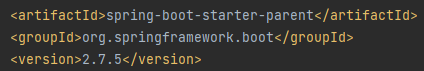
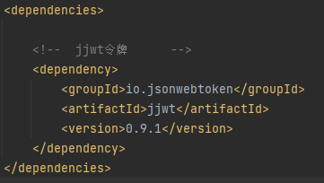
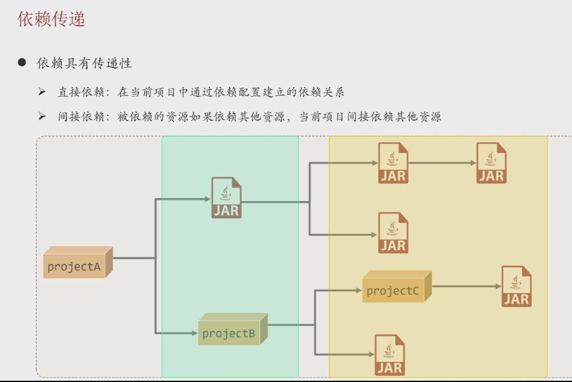
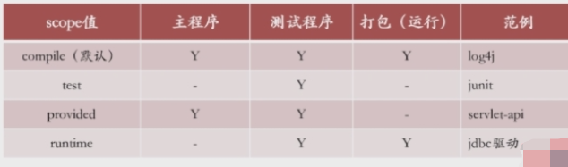
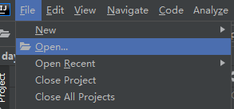
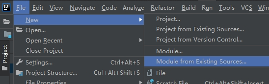
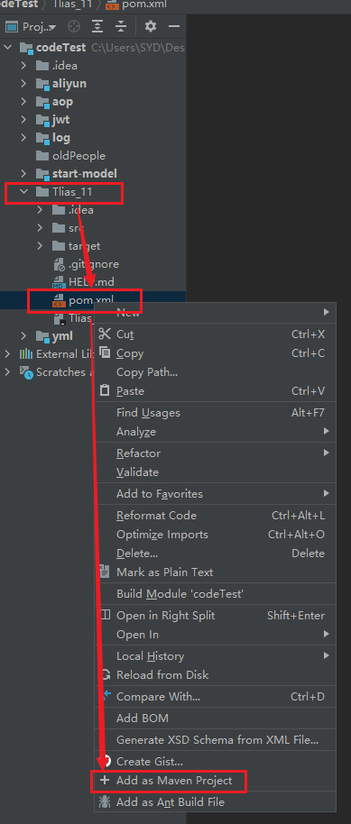
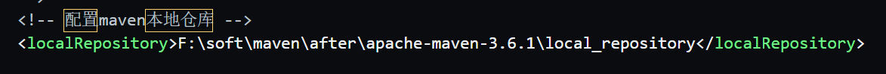
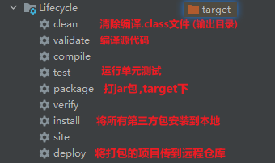

## 概述

### what

> - 用于管理和构建Java项目的工具
> - 基于项目对象模型POM

### why

> - 依赖管理
>   - 避免版本冲突
> - 统一项目结构
>   - 标准统一的项目架构
> - 项目构建
>   - 自动化项目构建

## Maven坐标 -- VGA

> - 概念
>   - 资源唯一标识符，通过该坐标可以唯一定位资源位置
> - 作用
>   - 使用坐标来定义项目或者引入项目中需要的依赖
> - 组成
>   - groupID：定义当前Maven项目隶属组织名称，通常是域名反写
>   - artifactId：定义当前Maven项目名称，通常是模块名
>   - version：定义当前项目版本号
>   - 
> - 使用
>   - 在 <dependencies> 里面使用  <dependency>  标签引入坐标
>   - 
> - 坐标获取
>   - maven仓库
>   - https://mvnrepository.com/


## 特点

### 依赖传递

> - 

## 排除依赖

> - 源头排除 -- <optional> -- 不传
>   - 如果你的项目依赖了一个库，并且这个库标记了某些依赖为可选，默认不传递，它不会自动传递给你的项目
>   - <optional>true</optional> 
> - 末端排除 -- <exclusions> -- 不收
>   - 当你引入某个依赖时，它可能会引入一些传递依赖（transitive dependencies），如果这些传递依赖是你不需要的，或者你希望使用自己指定的版本，可以通过 `exclusion` 元素来排除。
>   - <exclusions>
>             <exclusion>    //不需要加V
>                 <groupId>group-id-of-excluded-dependency</groupId>         //G
>                 <artifactId>artifact-id-of-excluded-dependency</artifactId>   //A
>        </exclusion>

## 作用范围

>- 使用<scope></scope>设置作用范围
>- 取值
>  - 


## 导入maven项目

> - 新窗口  
>   - 
> - 此窗口  
>   - 
> - 现有项目变为子项目
>   - 将文件拖入项目工程中
>   - xml文件右键加入maven项目
>   - 


## 生命周期

> - 是 Maven 中定义的一组阶段，每个生命周期包含多个阶段，每个阶段执行特定的任务，总共三个周期
> - 作用
>   - 用来组织和控制项目的构建过程
> - 目的
>   - 为了对所有的maven项目构建过程进行抽象和统一
> - 特点
>   - 三套周期相互独立
>   - 同周期   运行后期阶段，同周期的前期阶段都会运行


## 仓库

### 遍历顺序

> - 本地    ---》    私服     ---》     远程

 ### 本地

> - 安装时可设置
> - 后期修改在  settings.xml  中
> - 


### 私服及本地仓库配置

```
 <mirrors> 

<!-- 私服 -->
    <mirror>
      <!-- 配置私服仓库（远程仓库地址），本地若没有依赖，则来私服找 -->
      <id>alimaven</id>  
      <name>aliyun maven</name>  
      <url>https://maven.aliyun.com/repository/public</url>
      <mirrorOf>central</mirrorOf>  
    </mirror>

     
  </mirrors>
```


## 功能



> - 注意点
>   - 跳过test打包，有个闪电
>   - 直接打包无法时，要先执行install，否则本地并不存在第三方，会导致打包失败


