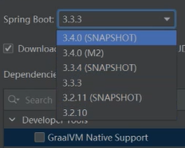
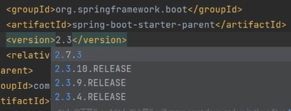
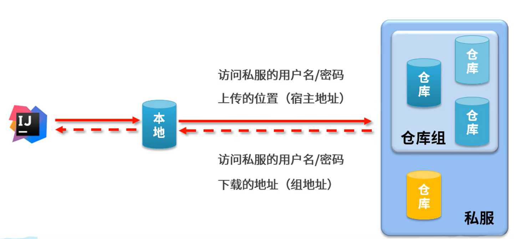
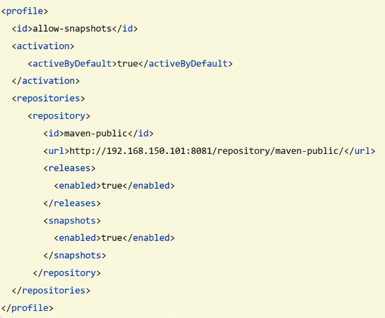

## maven版本控制

> - java版本控制
>   - <java.version>11</java.version>
> - maven编译版本控制
>   - <maven.compiler.source>11</maven.compiler.source>
>   - <maven.compiler.target>11</maven.compiler.target>

```xml
<properties>
        <java.version>11</java.version>
        <maven.compiler.source>11</maven.compiler.source>
        <maven.compiler.target>11</maven.compiler.target>
    </properties>
```


## 依赖生效规则

### 引入maven仓库依赖

#### **概述**

> - 当你在 pom.xml 中配置了依赖后，Maven 会下载相应的 JAR 并将其加入类路径。这些类会通过 Java 的类加载机制自动加载并供程序使用，不需要配置额外的扫描器。

#### **1、maven管理依赖**

> - 当你在 `pom.xml` 中添加依赖时，Maven 负责处理依赖的管理、下载和集成。
> - maven的启动机制是先加载JDK
>   - maven是基于JDK环境的软件
>   - 因此要配置JAVA_HOME
> - 之后遍历本地仓库
> - 若本地仓库中没有，则去私服，中央仓库下载
> - 下载后可以直接使用，
>   - Maven 和 Java 类加载机制的配合
>
> - 解析依赖坐标：Maven 根据 `groupId`、`artifactId` 和 `version` 来找到你需要的库。
>   - **下载依赖**：如果本地没有这个依赖，Maven 会从远程仓库（如 Maven Central）下载相应的 JAR 文件到本地仓库 (`.m2` 目录)。
> - 加入类路径：Maven 会将这些下载的依赖自动加入项目的类路径中。

#### 2、类路径与类加载

> 在编译和运行时，Maven 会通过构建工具（如 IDE 插件或命令行工具）将这些依赖 JAR 加入到类路径中。Java 的 **类加载器（ClassLoader）** 会在类路径中查找并加载这些 JAR 包中的类。
>
> 当你在代码中引用第三方库的类时，类加载器会根据类名和包名找到对应的类并加载到内存中，从而实现代码的正常运行。

#### 3. **不需要额外的扫描器**

> Maven 管理的第三方库通常不需要像 Spring 中的 `@ComponentScan` 那样进行组件扫描。这是因为这些第三方依赖中的类并不是为了依赖注入管理的 Bean，而是直接通过类路径加载到 JVM 中。所以只要 Maven 正确管理了依赖，并将其添加到类路径中，Java 就能自动找到并加载这些类。

#### 4. **编译时引用与运行时加载**

> Maven 将依赖添加到类路径中后：
>
> - **编译时**：你的项目可以引用这些依赖中的类，并在编译阶段验证类的存在和方法的正确性。
> - **运行时**：当应用运行时，Java 会在类路径中查找并加载这些依赖中的类。


### 引入第三方依赖

####　包路径相同时

> - 自动扫描，不用配置扫描器

#### 类路径不同时

> - 配置扫描器


## 分模块设计

> - 将单体项目拆分成多模块
> - 拆哪些？
>   - 公共的模块
> - 拆分后使用依赖引用来创建联系
> - 先针对模块功能进行设计，在进行编码


## **继承**

### 父依赖

> - 模块只做依赖管理，不涉及主体业务代码
> - 要指定打包方式
>   - <packaging>pom</packaging>

```xml
<?xml version="1.0" encoding="UTF-8"?>
<project xmlns="http://maven.apache.org/POM/4.0.0"
         xmlns:xsi="http://www.w3.org/2001/XMLSchema-instance"
         xsi:schemaLocation="http://maven.apache.org/POM/4.0.0 http://maven.apache.org/xsd/maven-4.0.0.xsd">
    <modelVersion>4.0.0</modelVersion>

    <groupId>com.itheima</groupId>
    <artifactId>tlias-parent</artifactId>
    <version>1.0-SNAPSHOT</version>
    
    <!--指定打包方式-->
    <packaging>pom</packaging>


    <!--起步依赖-->
    <parent>
        <artifactId>spring-boot-starter-parent</artifactId>
        <groupId>org.springframework.boot</groupId>
        <version>2.7.5</version>
    </parent>

<!--包含多个依赖版本,子类继承-控制共享的依赖及版本-->
    <dependencies>
        <dependency>
            <groupId>org.projectlombok</groupId>
            <artifactId>lombok</artifactId>
            <version>1.18.24</version>
        </dependency>

    </dependencies>

<!--只负责管理版本号,不负责依赖,控制子类不共享的依赖版本-->
    <!--管理版本号-->

    <properties>
        <jjwt>0.9.1</jjwt>
        <maven.compiler.source>11</maven.compiler.source>
        <maven.compiler.target>11</maven.compiler.target>
    </properties>

    <dependencyManagement>
        <dependencies>
            <dependency>
                <groupId>io.jsonwebtoken</groupId>
                <artifactId>jjwt</artifactId>
                <version>${jjwt}</version>
            </dependency>
        </dependencies>
    </dependencyManagement>
</project>
```


### 子依赖

> - <parent>
> - 指定父依赖路径坐标并配置父依赖路径   

```xml

    <parent>
        <artifactId>tlias-parent</artifactId>
        <groupId>com.itheima</groupId>
        <version>1.0-SNAPSHOT</version>
        <!--指定父依赖路径-->
        <relativePath>../tlias-parent/pom.xml</relativePath>
    </parent>

```


## 聚合

> - 概述
>
> - 将多个模块组织成一个整体，同时进行项目的构建
>
>   
>
> - 注意点
>
> - 要先install将第三方jar导到本地，才能用父类统一打包
>
> - 是指将多个项目模块组合成一个整体进行管理。通过使用聚合，多个模块可以共享相同的构建流程、版本管理和依赖管理。
>
> - 通常，在大型项目中，Maven 聚合用于简化和统一多个模块的管理。


## 私服

> - 一种特殊的远程仓库，用于代理位于外部的中央仓库，用于解决团队内部的资源共享与资源同步问题
>   - 小范围资源共享

### 三种仓库





> - release：发行版本
>   - 功能稳定
> - snapshot：快照版本
>   - 功能不稳定
> - central：


### nexus安装启动

> - 启动
>   - nexus.exe /run nexus
>   - 或者点击 start.bat
> - 网址
>   - localhost:8081


### 资源上传

> - 只能上传有权限的私服
>   - 中央仓库不允许上传



> - 用户名，密码配置在maven的setting中
> - 上传地址配置在ideal

#### maven设置用户名和密码和私服仓库

> - maven-setting.xml

```xml
 <servers>
    <!-- 配置访问服务器的权限,用户名和密码 -->
      <server>
          <id>maven-releases</id>
          <username>admin</username>
          <password>admin</password>
      </server>
    
      <server>
          <id>maven-snapshots</id>
          <username>admin</username>
          <password>admin</password>
      </server>
  </servers>
```


```
<!-- 跟换私服,将阿里云的私服屏蔽 -->
    <mirror>
      <id>maven-public</id>
      <mirrorOf>*</mirrorOf>
      <url>http://localhost:8081/repository/maven-public/</url>
    </mirror>
```


#### idea发布配置管理

	> - <id> 和仓库名匹配---上传到哪
	> - <url>---仓库位置
	> - 之所以在ideal中配置而不再maven中配置的原因是因为上传的仓库并不固定

> - ideal-pom.xml

```xml
 <!--发布配置-->
    <distributionManagement>
        <!-- release版本的发布地址 -->
        <repository>
            <!--id名需与仓库名一致-->
            <!--发布到谁上去-->
            <id>maven-releases</id>
            <!--仓库的地址-->
            <url>http://localhost:8081/repository/maven-releases/</url>
        </repository>

        <!-- snapshot版本的发布地址 -->
        <snapshotRepository>
            <id>maven-snapshots</id>
            <url>http://localhost:8081/repository/maven-snapshots/</url>
        </snapshotRepository>
    </distributionManagement>
```


### 资源下载

#### maven设置仓库组件地址

> - <id>maven-public<id>
> - 下载的时候不知到版本,所以仓库写public
>   - 先去public，再去


#### 配置




