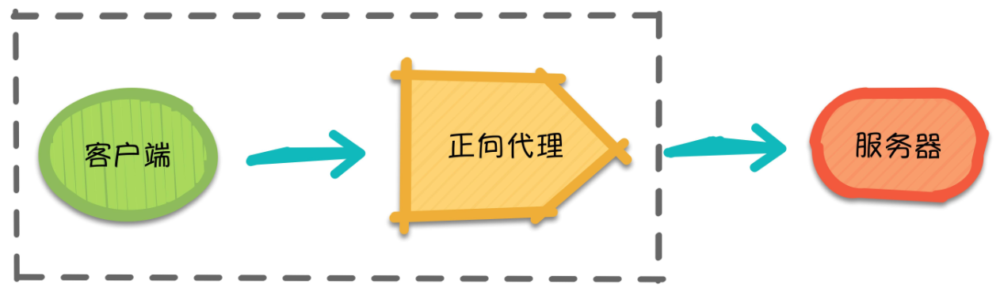

## 起源

> - Nginx 的出现是为了应对传统 HTTP 服务器（例如 Apache tomcat）在高并发场景下的性能问题，特别是"**C10K问题**"
>
>   - **C10K问题**
>     - 是指如何让服务器同时处理 1 万个并发连接。
>     - 当时的 HTTP 服务器（如 Apache）使用的是多进程或多线程模型，每个连接都需要单独的进程或线程来处理。
>     - 当并发连接数量增加时，服务器资源（CPU 和内存）消耗迅速增加，导致性能瓶颈。
>
> - Nginx 的设计目标是解决这个高并发问题。
>
>   - 它采用了**异步、非阻塞、事件驱动**架构，与 Apache 等传统服务器的多进程/多线程模型不同。
>   - 通过这种架构，Nginx 能够在单个工作进程中处理大量的并发连接，从而显著提高性能和资源利用率。
>
>   
>
> - **没有什么是加一层解决不了的问题，如果有，那就再加一层**


## 概述

> - Nginx（发音同engine x）是一个异步框架的 Web 服务器，也可以用作反向代理，负载平衡器 和 HTTP 缓存。


## 特点

> - 更快：
>   - 单次请求会得到更快的响应。
>   - 在高并发环境下，Nginx 比其他 WEB 服务器有更快的响应。
> - 高扩展性：
>   - Nginx 是基于模块化设计，由多个耦合度极低的模块组成，因此具有很高的扩展性。许多高流量的网站都倾向于开发符合自己业务特性的定制模块。
> - 高可靠性：
>   - Nginx 的可靠性来自于其核心框架代码的优秀设计，模块设计的简单性。另外，官方提供的常用模块都非常稳定，每个 worker 进程相对独立，master 进程在一个 worker 进程出错时可以快速拉起新的 worker 子进程提供服务。
> - 低内存消耗：
>   - 一般情况下，10000个非活跃的 `HTTP Keep-Alive` 连接在 Nginx 中仅消耗 `2.5MB` 的内存，这是 Nginx 支持高并发连接的基础。
>   - 单机支持10万以上的并发连接：**理论上，Nginx 支持的并发连接上限取决于内存，10万远未封顶。**
> - 热部署:
>   - master 进程与 worker 进程的分离设计，使得 Nginx 能够提供热部署功能，即在 7x24 小时不间断服务的前提下，升级 Nginx 的可执行文件。当然，它也支持不停止服务就更新配置项，更换日志文件等功能。
> - 最自由的 BSD 许可协议:
>   - 这是 Nginx 可以快速发展的强大动力。BSD 许可协议不只是允许用户免费使用 Nginx ，它还允许用户在自己的项目中直接使用或修改 Nginx 源码，然后发布。


## 设计初衷

> - **高并发处理能力**：Nginx 能够同时处理数万甚至更多的并发连接。
> - **低资源消耗**：使用更少的 CPU 和内存处理大量连接。
> - **高效的静态内容服务**：Nginx 非常适合处理静态内容，例如图片、HTML 文件等。
> - **反向代理和负载均衡**：Nginx 可作为反向代理服务器和负载均衡器，帮助分发流量到后端服务器，减轻负载压力。


## 正向代理 -- 代理客户端

> - 概念
>   - 假设客户端想要访问 Google，它明确知道待访问的服务器地址是 https://www.google.com/ ，但由于条件限制，它找来了一个能够访问到]oogle 的”朋友”：代理服务器。
>   - 客户端把请求发给代理服务器，由代理服务器代替它请求 Google，最终再将响应返回给客户端。这便是一次正向代理的过程，该过程中服务器并不知道真正发出请求的是谁。
> - 示例
>   - 梯子是一种正向代理。
>   - 它通过中间服务器帮助用户访问被封锁或限制的网站。
>   - 用户的请求首先发送到代理服务器，然后代理服务器再将请求转发到目标网站，最终将响应返回给用户。
>   - **这种方式可以隐藏用户的真实IP地址**，并绕过网络限制。因此，梯子通常被用于访问被防火墙屏蔽的内容。
> - 基本流程
>   - **客户端请求**：用户向代理服务器发送请求，访问被限制的网站。
>   - **代理转发请求**：代理服务器接收到请求后，将其转发到目标网站。
>   - **目标网站响应**：目标网站处理请求并返回响应数据给代理服务器。
>   - **代理返回内容**：代理服务器将目标网站的响应数据再转发回客户端。




## 反向代理 -- 代理服务器端

> - 反向 
>   - 正向代理主要用于隐藏客户端的真实IP，使得客户端通过代理访问互联网，而反向代理则隐藏后端服务器的真实IP，客户端只与代理服务器交互。
> - 管控
>   - 主要作用在于客户端不直接接触后端服务器，而是通过代理服务器进行请求。这使得后端地址可以被隐藏或更改，而客户端只需与代理交互


## 负载均衡

> - 两种策略
>   - 内置策略
>   - 扩展策略

### 内置策略

> - 轮询
>
>   - 依次
>
>     
>
> - 加权轮询
>
>   - 服务器越牛，权重越大，比例越大
>
>     
>
> - iphash
>
>   - 将IP进行hash，根据hash结果将同一台客户端IP的请求分发给同一台服务器进行处理
>   - 可以解决session不共享的问题（使用的Redis做session共享，不推荐使用ngnix）


```conf
# 全局配置  
#user  nobody;
worker_processes  1;

#error_log  logs/error.log;
#error_log  logs/error.log  notice;
#error_log  logs/error.log  info;

#pid        logs/nginx.pid;


# 处理与连接相关的事件  
events {
    # 每个进程的最大连接数
    worker_connections  1024;

    # 使用的事件处理模型
    # epoll（Linux）、kqueue（BSD）、select 和 poll。在 Linux 系统中，推荐使用 epoll，因为它能更有效地处理大量并发连接。
    use epoll; 
    
    # 连接接收
    # 开启多连接接收,增加并发处理
     multi_accept on;  
}

# Http配置
# 内可配置多个端口
http {
    include       mime.types;
    default_type  application/octet-stream;

    #log_format  main  '$remote_addr - $remote_user [$time_local] "$request" '
    #                  '$status $body_bytes_sent "$http_referer" '
    #                  '"$http_user_agent" "$http_x_forwarded_for"';

    #access_log  logs/access.log  main;

    sendfile        on;
    #tcp_nopush     on;

    #keepalive_timeout  0;
    keepalive_timeout  65;

    #gzip  on;


    # 负载均衡配置
    upstream two_server {

           # 若weight都相同,则轮询--每人一次
            server 127.0.0.1:8080 weight=1;
            server 127.0.0.1:8081 weight=1;
            # 若weight不同,则夹权轮询--两次
            server 127.0.0.1:8082 weight=2;
           
            # 权值是比例的意思,上边的配置意味着每四次,8000和8001各一次,8002两次

        }

    # server配置
    server {
        # 监听90端口
        listen       90;
        server_name  localhost;


        # 代理配置
        location / {
            root   html;
            index  index.html index.htm;
        }

        location /api/ {

            # 代理 -- url方式
			proxy_pass http://localhost:8080;

            # 代理 -- 负载方式
			proxy_pass http://two_server;

        }
        
        # 错误页
        error_page   500 502 503 504  /50x.html;
        location = /50x.html {
            root   html;
        }
    }

    # 监听80端口
    server{
        listen 80;
        server_name  localhost;

        # 反向代理
    }

}

```


## 安全 -- 限流

