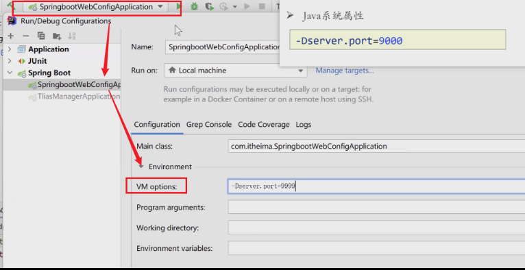
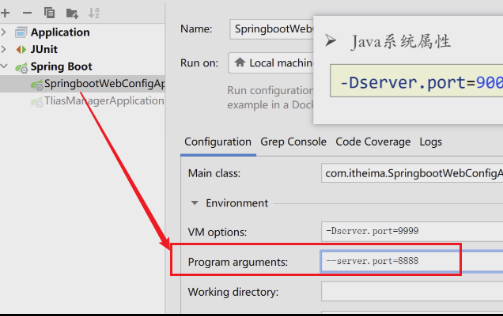
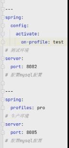

# 补充知识

## 配置文件的优先级

> properties > yml  > yaml

## 配置方式

> - java系统属性：VW　options
>   - 优先级高于配置文件

> - 命令行参数：Program arguments

## 命令行启动及配置

## 不同环境的配置切换

### 可能会遇到的环境

> - 开发环境
> - 测试环境
> - 生产环境

### 解决办法

#### 多文件配置

> - 在 `application.properties` 文件中添加 `spring.profiles.active` 指定要激活的环境
> - **多套环境配置文件的命名规范：**
>   - **默认配置**：`application.properties` 或 `application.yml`
>   - **开发环境**：`application-dev.properties` 或 `application-dev.yml`
>   - **测试环境**：`application-test.properties` 或 `application-test.yml`
>   - **预生产环境**：`application-preprod.properties` 或 `application-preprod.yml`
>   - **生产环境**：`application-prod.properties` 或 `application-prod.yml`

#### 单文件配置

> - "---"分隔
> - 起别名
>   - Spring.properties=dev
> - spring.profiles.active 指定要激活的环境

## Bean管理

### 获取bean

> - 默认情况，Spring项目启动时，会把bean创好放在IOC中
>   - 扫描启动类的包内全部内容
> - 主动获取
>   - 名字
>   - 类型
>   - 

### bean作用域

### 第三方bean

