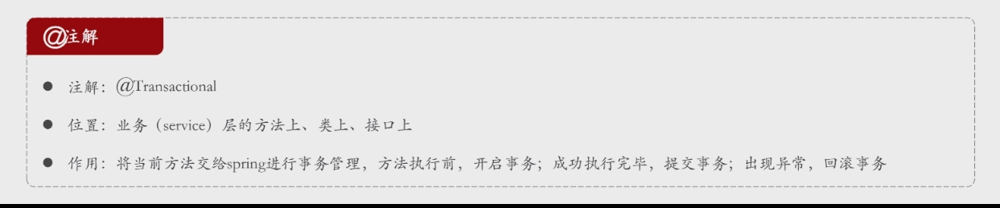
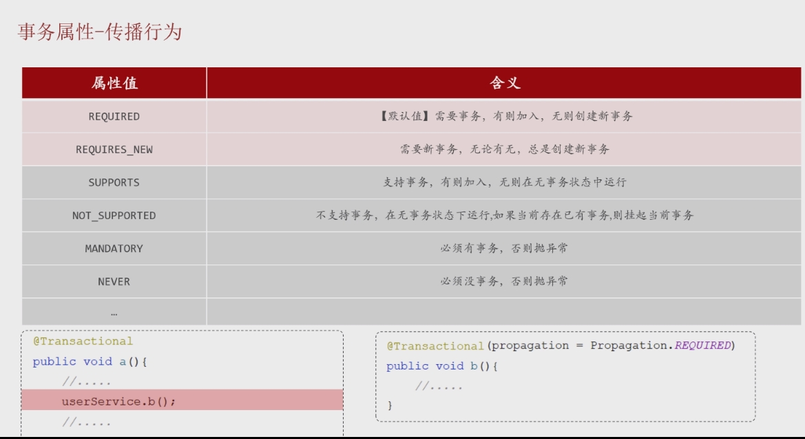

## 事物

> - 概述
>   - 是指将一系列数据操作捆绑成为一个整体进行统一管理 (生死与共)
>   - 最小的控制单元来使用的
> - 四个属性
>   - 原子性：整体不可分割
>   - 一致性：数据必须处于一致状态
>   - 隔离性：并发事物是彼此隔离的
>   - 持久性：事物处理的结果都是永久的


## 实现方式

### 编程式事务管理

> - 实现步骤
>   - 获取事务管理器
>   - 开始事务
>   - 提交事务
>   - 回滚事务


### 注解式事务管理  @Transactional



#### 基本实现


> -  **使用推荐**
> -  **最好用在接口的方法上**
>   - **方法级别的粒度控制**
>  使用 `@Transactional` 注解在接口的方法上可以更好地控制事务的粒度。有些方法可能需要事务，而有些方法不需要，将注解放在方法级别可以灵活地配置不同的事务管理需求。
>   - **明确业务逻辑需求**
>  将 `@Transactional` 注解放在方法上可以使事务管理的范围更加明确，代码也更加清晰，尤其当一个类中有多个方法时，你可以根据每个方法的需求决定是否需要事务。


## 事务失效

> - RunException
> - roolbackFor


## 事物传播 @Transactional

> - 概述
>   - 一个事物被另一个事物方法调用，被调用事物的不同态度产生了不同的结果
> - 场景
>   - 解散部门不论是否成功都要记录日志





### 实现

```
@Transactional( propagation = Propagation.REQUIRED )
```


## 控制台事务日志配置

```yaml
#开启spring事务管理日志
logging:
  level:
    org.springframework.jdbc.support.JdbcTransactionManager: debug
```

​	