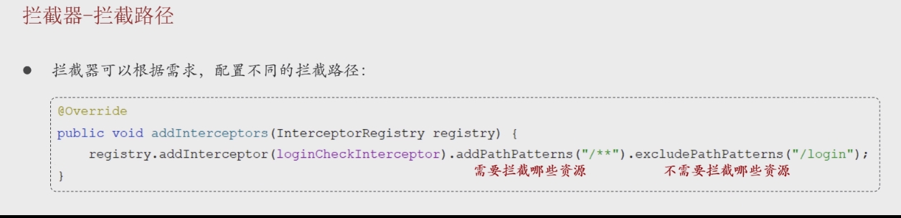

## 概述

> - 拦截器是 **Spring** 框架提供的核心功能之一，允许开发人员提前预定义一些逻辑，在用户的请求、响应前后执行。也可以在用户请求前阻止其执行或者在请求完成之后做一些资源释放。
> - 拦截器可以调用 IOC 容器中的各种依赖，而过滤器不能 


## 拦截器基本流程

### 创建拦截器类

> - 实现HandlerInterceptor接口
> - 重写perHandle方法
>   - true放行
> - 在类上加上@component,交由类管理


```java
@Component//交给IOC容器
@Slf4j
public class MyInterceptor implements HandlerInterceptor {

//    拦截资源请求方法
    @Override
    public boolean preHandle(HttpServletRequest request, HttpServletResponse response, Object handler) throws Exception {
        log.info("拦截");
        //放行：通过返回值进行放行操作：true放行，false不放行
        return true;
    }


//    放行后的方法
    @Override
    public void postHandle(HttpServletRequest request, HttpServletResponse response, Object handler, ModelAndView modelAndView) throws Exception {
        HandlerInterceptor.super.postHandle(request, response, handler, modelAndView);
    }

    @Override
    public void afterCompletion(HttpServletRequest request, HttpServletResponse response, Object handler, Exception ex) throws Exception {
        HandlerInterceptor.super.afterCompletion(request, response, handler, ex);
    }
}
```


### 注册一个配置类

> - 实现WebmvcConfigure接口
> - 添加@Configuration注解表示当前类是一个配置类
> - 重写addInterceptors方法


```java
@Configuration  //添加了此注解表示当前类是一个配置类
public class WebConfig implements WebMvcConfigurer {

    //注入入门拦截器
//    @Autowired
//    MyInterceptor myInterceptor;

    //注入登录拦截器
    @Autowired
    LoginInterceptor loginInterceptor;

    // 配置拦截器
    @Override
    public void addInterceptors(InterceptorRegistry registry) {

        //配置拦截资源
        //registry.addInterceptor(myInterceptor).addPathPatterns("/**");

        //配置拦截资源
        registry
                .addInterceptor(loginInterceptor)
                //配置拦截路径
                .addPathPatterns("/**")
                //可设置不拦截路径
                .excludePathPatterns("/login");

    }

}
```


### 配置拦截路径



