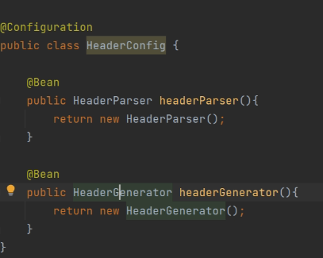

## 一、启动类注解

> **@SpringBootApplication**
>
> - 这是 Spring Boot 应用的入口注解，通常放在主类上。它是以下三个注解的组合：
> - **@Configuration：**
>   - 标记类为配置类。
> - **@EnableAutoConfiguration：**
>   - 启用 Spring Boot 的自动配置功能。
> - **@ComponentScan：**
>   - 自动扫描并注册标注了 @Component、@Service、@Controller 等注解的 Bean。

## 二、反转及注入

> ###  @Component，@Bean ，@Configuration
>
> - **@Component**   更适合用于自动扫描并管理用户自定义的类
> - **@Bean**   主要用于手动定义并注册第三方或更复杂的 Bean
> - **@Configuration**   通常用于定义配置类

### **@Component：**

> - 用于将类标记为 Spring 容器中的 Bean，Spring 会自动将其作为组件进行扫描和管理
> - 需要配合**组件扫描**（例如使用 `@ComponentScan`）来自动发现和注册 Bean。
>   - 特化版本，在功能上与 `@Component` 类似，但具有不同的语义。
>     - **@Controller**
>     - **@Service**
>     - **@Repository**
>     - **@Mapper**
>
> - 为什么有时不需要显式使用 `@ComponentScan`？
>   - 在 Spring Boot 应用中，通常会有一个启动类，标注了 `@SpringBootApplication` 注解，而 `@SpringBootApplication` 实际上是一个复合注解，它内部包含了 `@ComponentScan`
>   - 默认情况下，`@ComponentScan` 会扫描启动类所在包及其子包中的所有组件
>   - 因此，如果你的 `@Service`、`@Controller`、`@Repository` 等注解的类在启动类的同一个包或者子包中，就不需要显式添加 `@ComponentScan`，Spring Boot 会自动扫描并注册这些组件,位于这些包中的 `@Service` 等注解的类会自动被注册为 Bean

### **@Bean：**

> 
>
> - 用于**方法级别**的注解。
> - 通常在**配置类**中使用，通过方法定义 Bean，Spring 会将该方法的返回值注册为一个 Bean。
> - 常用于**第三方库**或**不直接通过类注解的 Bean** 注册场景，或者当你需要更灵活地控制 Bean 的创建逻辑时。
>   - 配置类通常使用 **`@Configuration`** 注解。
> - **注意点**
> - 一定要有返回值
> - 返回值是对象，因此可以放到IOC中
> - 
> - 只能通过参数传入对象，不能使用@Autowired
>   - 通过外部会产生顺序问题---对象会有null的可能
>
> 
>
> **@value**：
>
> - 用于指定 Bean 的名称。如果未提供，默认情况下 Bean 的名称为类名的**首字母小写形式**

### **@Configuration**

> - 

### **@Autowired**

> - **自动注入**
> - **不允许在本类中注入自己，会导致循环依赖**
> - **多个匹配Bean**
>   - 当一个接口有多个实现时，Spring 容器在注入依赖时可能会遇到不确定性
>   - `@Primary` 
>   - @Qualifier
>
> 

## 三、Web控制器注解

> ### Controller
>
> **@RestController**：
>
> - 结合了 `@Controller` 和 `@ResponseBody`
>   -  `@Controller`：控制器
>   - `@ResponseBody`：封装返回值
>   
> - 用于定义 RESTful API 控制器，直接返回 JSON 或 XML 等格式的数据，而不是视图
>
>   
>
> ### Mapping
>
> **@RequestMapping**：
>
> **通用版**
>
> - 用于定义 URL  **映射** 和请求方法，可以用在类或方法上。
> - 可设置前缀路径，类似于 axios 里面的 baseUrl
>
> **特化版**
>
> - 用于处理 HTTP  GET、POST、PUT 和 DELETE 请求的简写注解。它们是 `@RequestMapping` 注解的具体化版本。
>
> - **@GetMapping**
>   - 用于请求资源。它从服务器获取数据而不对资源进行修改。
>   - 请求参数通常附加在 URL 中
> - **@PostMapping**
>   - 用于提交数据给服务器，通常用于创建新的资源。
>   - 可以包含大量数据。
> - **@PutMapping**
>   - 用于更新服务器上的资源。如果资源不存在，可以选择创建资源
>   - 请求参数通常放在请求体中
>   - 更新资源时应包含完整的数据。
>     - `PUT` 的设计目标是完全替换指定资源的内容。如果你发送一个 `PUT` 请求，服务器将用请求体中的数据完全替换指定的资源。这种设计意味着请求体必须包含资源的全部数据，以确保更新后的资源是完整的。
>     - 如果 `PUT` 请求只包含部分字段，可能会导致缺少的字段被置为 `null` 或使用默认值
> - **@DeleteMapping**
>   - 用于删除服务器上的资源。
>   - 请求参数通常附加在 URL 中
>
> **注意点**
>
> - **Spring 不允许两个相同的控制器方法映射到相同的路径**
>
>   - 当客户端请求路径时时，Spring 无法判断应该调用 哪个方法，因此会抛出路径冲突的异常。
>
>   
>
> ### 请求参数
>
> **@PathVariable**：
>
> - 绑定 URL 中的  **路径变量**  （/path/{id}） 到方法参数上。用于 RESTful 风格的接口。
>
> **@RequestBody**：
>
> - 将 HTTP 请求体绑定到方法参数，用于处理   **JSON 或 XML**   请求体。
> - **@DateTimeFormat**
>   - @DateTimeFormat (pattern = "yyyy-MM-dd")
>   - 时间格式参数，用于格式时间日期
>
> **@RequestParam**：
>
> - 用于将请求参数绑定到控制器方法的参数上
> - public String search (  @RequestParam (value = "query", required = false)   String query) 

## 四、Mybatis常用注解

> **类注解**
>
> **@Mapper**
>
> - 是 MyBatis 框架中的一个注解，用于将 Java 接口与 SQL 映射起来，负责执行数据库的操作
> - **@Mapper与@Repository**
>
>   - 使用 @Mapper 就不需要再使用 @Repository，因为它已经承担了类似的职责，即标识数据访问层。
>
>   - @Mapper 专用于 MyBatis Mapper 接口，而 @Repository 是 Spring 提供的用于标识 DAO 层的注解。
>
>  
>
> **SQL语句注解**
>
> - **@Select：**用于执行查询操作，并将结果映射到方法返回类型。
>
>   - @Select("SELECT * FROM users WHERE id = #{id}")
>   User selectUserById(int id);
>   
>   
>   
> - **@Insert**
>
>    - @Insert("INSERT INTO users(name, email) VALUES(#{name}, #{email})")
>       void insertUser(User user);
>
>       
>
> - **@Update**
>    - @Update("UPDATE users SET name = #{name} WHERE id = #{id}")
>      void update(User user);
>
>    
> - **@Delete**
>
>     - @Delete("DELETE FROM users WHERE id = #{id}")
>       void deleteUser(int id);
>
>       
>
> - **@Param**
>
>   - @Select("SELECT * FROM users WHERE name = #{name}")
>     User selectUserByName(@Param("name") String name);
>
>     
>
> - **@Results 和 @Result**
>
>    - @Select("SELECT * FROM users WHERE id = #{id}")
>   @Results({
>    	@Result(property = "id", column = "id"),
>    	@Result(property = "name", column = "name"),
>    	@Result(property = "email", column = "email")
>   })
>    User selectUserById(int id);
>    
>   
>   
> - **使用规范**
>
>   - 使用注解的方式可以提高代码的可读性，但 **复杂的 SQL 查询** 可能更适合使用 XML 映射文件。
>
> 

